# Criterion B – Design Overview

> **Product:** Student Peer-Tutoring Portal  
> **Tech Stack:** Java 17, Spring Boot 3, Spring Security, Thymeleaf, JPA/Hibernate, H2/PostgreSQL, JGraphT  
> **All artefacts are derived from the actual implemented codebase.**

---

## 1. Proposed Data Structures / Databases

### 1.1 Entity: `users` table — `src/main/java/com/example/studentportal/model/User.java`

| Field Name | Data Type | Validation | Example | Source File Path |
|---|---|---|---|---|
| `id` | BIGINT (auto) | Auto-generated primary key; never null | `42` | `model/User.java` |
| `full_name` | VARCHAR | `@NotBlank` — must not be blank | `"Alice Chen"` | `model/User.java` |
| `email` | VARCHAR (unique) | `@Email`, `@Pattern(.*@example\.edu$)` — must be valid email ending in `@example.edu`; unique | `"12345@example.edu"` | `model/User.java` |
| `password_hash` | VARCHAR | `@NotBlank`, `@Size(min=4)` — BCrypt hash stored; raw password ≥ 4 chars | `"$2a$10$..."` | `model/User.java` |
| `role` | VARCHAR | Not null; auto-determined: digit-first local part → `STUDENT`, else `ADMIN` | `"STUDENT"` | `model/User.java`, `service/UserService.java` |
| `year_group` | INTEGER | `@Min(9)`, `@Max(9–13)` — integer 9–13; null allowed for ADMIN | `11` | `model/User.java` |
| `exam_board` | VARCHAR | One of `GCSE`, `A_LEVELS`, `IB`, `NONE`; Year 9–11 auto-set to `GCSE`; Year 12–13 must be `A_LEVELS` or `IB` | `"A_LEVELS"` | `model/User.java` |
| `profile_complete` | BOOLEAN | Derived flag; true iff `year_group` set, subjects non-empty, availability non-empty | `true` | `model/User.java` |
| `created_at` | TIMESTAMP | `@CreationTimestamp` — set on insert; not updatable | `2025-10-01T09:00:00` | `model/User.java` |
| `updated_at` | TIMESTAMP | `@UpdateTimestamp` — set on every update | `2025-11-14T14:32:00` | `model/User.java` |

### 1.2 Join Table: `user_subjects` — Many-to-Many User ↔ Subject

| Field Name | Data Type | Validation | Example | Source File Path |
|---|---|---|---|---|
| `user_id` | BIGINT (FK → users.id) | Not null; references valid user | `42` | `model/User.java` |
| `subject_id` | BIGINT (FK → subjects.id) | Not null; references valid subject | `3` | `model/User.java` |

### 1.3 Element-Collection Table: `user_availability`

| Field Name | Data Type | Validation | Example | Source File Path |
|---|---|---|---|---|
| `user_id` | BIGINT (FK → users.id) | Not null; references valid user | `42` | `model/User.java` |
| `timeslot` | VARCHAR | Must be a recognised code from `Timeslots.ALL_CODES_SET`; invalid codes discarded by `filterValid()` | `"MON_P1"` | `model/User.java`, `util/Timeslots.java` |

### 1.4 Entity: `requests` table — `src/main/java/com/example/studentportal/model/Request.java`

| Field Name | Data Type | Validation | Example | Source File Path |
|---|---|---|---|---|
| `id` | BIGINT (auto) | Auto-generated primary key | `101` | `model/Request.java` |
| `user_id` | BIGINT (FK → users.id) | `@NotNull` — must reference existing user | `42` | `model/Request.java` |
| `type` | VARCHAR | `@NotNull`; value must be `"TUTOR"` or `"TUTEE"` | `"TUTOR"` | `model/Request.java` |
| `subject_id` | BIGINT (FK → subjects.id) | `@NotNull` — must reference valid subject | `3` | `model/Request.java` |
| `chosen_timeslot` | VARCHAR | Nullable; set to a single valid timeslot code after matching | `"TUE_P3"` | `model/Request.java` |
| `week_start_date` | DATE | Nullable; set to Monday of current week when matching runs | `2025-11-10` | `model/Request.java`, `util/DateUtil.java` |
| `status` | VARCHAR | Default `"PENDING"`; state machine: `PENDING → MATCHED → DONE` or `→ CANCELLED` | `"MATCHED"` | `model/Request.java` |
| `archived` | BOOLEAN | Default `false`; set `true` by admin archive action for `DONE`/`CANCELLED` requests | `false` | `model/Request.java` |
| `matched_partner_id` | BIGINT (FK → users.id) | Nullable; populated when status becomes `MATCHED`; cleared on user deletion | `67` | `model/Request.java` |
| `created_at` | TIMESTAMP | `@CreationTimestamp` — set on insert; not updatable | `2025-10-27T11:00:00` | `model/Request.java` |

### 1.5 Element-Collection Table: `request_timeslots`

| Field Name | Data Type | Validation | Example | Source File Path |
|---|---|---|---|---|
| `request_id` | BIGINT (FK → requests.id) | Not null | `101` | `model/Request.java` |
| `timeslot` | VARCHAR | Valid timeslot code from `Timeslots.ALL_CODES_SET`; invalid codes discarded | `"WED_P2"` | `model/Request.java`, `util/Timeslots.java` |

### 1.6 Entity: `subjects` table — `src/main/java/com/example/studentportal/model/Subject.java`

| Field Name | Data Type | Validation | Example | Source File Path |
|---|---|---|---|---|
| `id` | BIGINT (auto) | Auto-generated primary key | `3` | `model/Subject.java` |
| `code` | VARCHAR (unique) | `@NotBlank`; unique; used as canonical identifier | `"MATHS"` | `model/Subject.java` |
| `display_name` | VARCHAR | `@NotBlank`; human-readable label shown in UI | `"Mathematics"` | `model/Subject.java` |

Pre-seeded subjects (10): English, German, French, Mathematics, Physics, Biology, Chemistry, Economics, Politics, Business — `config/DataSeeder.java`

### 1.7 Timeslot Utility Constants — `src/main/java/com/example/studentportal/util/Timeslots.java`

| Code | Label | Period End Time | Source File Path |
|---|---|---|---|
| `MON_P1` | Monday, P1 | 09:50 | `util/Timeslots.java` |
| `MON_P2` | Monday, P2 | 10:45 | `util/Timeslots.java` |
| `MON_P3` | Monday, P3 | 11:35 | `util/Timeslots.java` |
| `MON_P4` | Monday, P4 | 12:25 | `util/Timeslots.java` |
| `MON_P5` | Monday, P5 | 14:05 | `util/Timeslots.java` |
| `MON_P6` | Monday, P6 | 14:55 | `util/Timeslots.java` |
| `MON_P7` | Monday, P7 | 15:45 | `util/Timeslots.java` |
| `TUE_P1`–`FRI_P7` | Tuesday–Friday, P1–P7 | same period end times | `util/Timeslots.java` |

Total: 35 codes (5 days × 7 periods).

---

## 2. Product Designs (UI Design Mockups)

### 2.1 Home / Landing Page — `templates/index.html`

**Purpose:** Public landing page linking to login and register pages.

```
┌────────────────────────────────────────────────────┐
│  HEADER: Student Peer-Tutoring Portal              │
├────────────────────────────────────────────────────┤
│                                                    │
│   [Welcome Banner]                                 │
│                                                    │
│   ┌──────────────┐   ┌──────────────────────────┐  │
│   │  [Login]     │   │  [Register]              │  │
│   └──────────────┘   └──────────────────────────┘  │
│                                                    │
└────────────────────────────────────────────────────┘
```

| Element | Annotation |
|---|---|
| Login button | Links to `GET /login` |
| Register button | Links to `GET /register` |

---

### 2.2 Login Screen — `templates/login.html`

**Purpose:** Authenticates existing users and redirects to role-appropriate dashboard.

```
┌────────────────────────────────────────────────────┐
│  HEADER                                            │
├────────────────────────────────────────────────────┤
│  Login                                             │
│  ┌──────────────────────────────────────────────┐  │
│  │ Email:     [________________________]        │  │
│  │ Password:  [________________________]        │  │
│  │                                              │  │
│  │ [Error message if login fails — red text]    │  │
│  │                                              │  │
│  │            [  Log In  ]                      │  │
│  └──────────────────────────────────────────────┘  │
│  Don't have an account? [Register]                 │
└────────────────────────────────────────────────────┘
```

| Element | Annotation |
|---|---|
| Email field | POSTed to Spring Security `/login` as `username` param |
| Password field | POSTed as `password` param |
| Error message | Shown when `?error` query param present |
| Log In button | Submits form; success → `CustomAuthenticationSuccessHandler` redirects by role |
| Register link | Links to `GET /register` |

---

### 2.3 Registration Screen — `templates/register.html`

**Purpose:** Creates a new student or admin account; auto-authenticates on success.

```
┌────────────────────────────────────────────────────┐
│  HEADER                                            │
├────────────────────────────────────────────────────┤
│  Create an Account                                 │
│  ┌──────────────────────────────────────────────┐  │
│  │ Full Name:  [________________________]       │  │
│  │             [validation error if blank]      │  │
│  │                                              │  │
│  │ Email:      [________________________]       │  │
│  │             [must end @example.edu]          │  │
│  │                                              │  │
│  │ Password:   [________________________]       │  │
│  │             [min 4 characters]               │  │
│  │                                              │  │
│  │            [ Register ]                      │  │
│  └──────────────────────────────────────────────┘  │
│  Already have an account? [Login]                  │
└────────────────────────────────────────────────────┘
```

| Element | Annotation |
|---|---|
| Full Name field | `@NotBlank` validated server-side |
| Email field | `@Email` + `@Pattern(.*@example\.edu$)` validated |
| Password field | `@Size(min=4)` validated; BCrypt-hashed before storage |
| Register button | `POST /register`; on success: auto-authenticates, redirects to `/profile` |
| Inline error messages | Displayed per field using Thymeleaf `th:errors` |

---

### 2.4 Profile Completion Screen — `templates/profile.html`

**Purpose:** Collects year group, exam board, subjects, and timeslot availability for a student.

```
┌────────────────────────────────────────────────────┐
│  HEADER  [Logout]                                  │
├────────────────────────────────────────────────────┤
│  My Profile                                        │
│  ┌──────────────────────────────────────────────┐  │
│  │ Year Group: [9 ▼] (dropdown 9–13)            │  │
│  │                                              │  │
│  │ Exam Board: [GCSE ▼] / [A_LEVELS] / [IB]    │  │
│  │   (A_LEVELS/IB only shown for Yr 12–13)      │  │
│  │                                              │  │
│  │ Subjects (select one or more):               │  │
│  │  ☐ English  ☐ Mathematics  ☐ Physics         │  │
│  │  ☐ Biology  ☐ Chemistry   ☐ Economics        │  │
│  │  ☐ German   ☐ French      ☐ Politics         │  │
│  │  ☐ Business                                  │  │
│  │                                              │  │
│  │ Availability (select timeslots):             │  │
│  │  ☐ Mon P1  ☐ Mon P2  ☐ Tue P1  ☐ Tue P2    │  │
│  │  … (35 timeslot checkboxes, MON–FRI P1–P7)  │  │
│  │                                              │  │
│  │            [ Save Profile ]                  │  │
│  └──────────────────────────────────────────────┘  │
│  [ Delete Account ]                                │
└────────────────────────────────────────────────────┘
```

| Element | Annotation |
|---|---|
| Year Group dropdown | Integer 9–13; sets `examBoard` to `GCSE` if 9–11 |
| Exam Board selector | Radio/select; A_LEVELS or IB required for Year 12–13 |
| Subject checkboxes | Multi-select; at least one required to complete profile |
| Timeslot checkboxes | 35 options (MON_P1…FRI_P7); at least one required |
| Save Profile button | `POST /profile`; updates DB; recalculates `profileComplete` flag |
| Delete Account button | `POST /profile/delete-account`; deletes user, logs out |

---

### 2.5 Student Dashboard — `templates/dashboard.html`

**Purpose:** Shows a student's tutoring requests with status, matched partner, and chosen timeslot.

```
┌────────────────────────────────────────────────────┐
│  HEADER  Hello, Alice!  [Logout]                   │
├────────────────────────────────────────────────────┤
│  My Tutoring Requests  [+ New Request]             │
│  ┌──────────────────────────────────────────────┐  │
│  │ Subject  │ Type    │ Status  │ Partner │ Slot │  │
│  │──────────┼─────────┼─────────┼─────────┼─────│  │
│  │ Maths    │ TUTEE   │ MATCHED │ Bob     │Tue P1│  │
│  │ Physics  │ TUTOR   │ PENDING │ —       │ —   │  │
│  │ English  │ TUTEE   │ DONE    │ Carol   │Mon P2│  │
│  │──────────┼─────────┼─────────┼─────────┼─────│  │
│  │ [Cancel] (PENDING/MATCHED only)              │  │
│  └──────────────────────────────────────────────┘  │
│  [Show Archived Requests]                          │
└────────────────────────────────────────────────────┘
```

| Element | Annotation |
|---|---|
| New Request button | Links to `GET /requests/new` |
| Request table | Lists all non-archived requests; columns: Subject, Type, Status, Partner, Timeslot |
| Partner column | Shows `matchedPartner.fullName` (SC 12) |
| Timeslot column | Shows `chosenTimeslot` label from `Timeslots.LABELS` |
| Cancel button | `POST /requests/{id}/cancel`; visible for PENDING/MATCHED; cascade-cancels partner |
| Show Archived | Toggle `?showArchived=true` to include archived requests |

---

### 2.6 New Tutoring Request Form — `templates/request_form.html`

**Purpose:** Allows a student to create a TUTOR or TUTEE request for a subject and timeslots.

```
┌────────────────────────────────────────────────────┐
│  HEADER  [Logout]                                  │
├────────────────────────────────────────────────────┤
│  New Tutoring Request                              │
│  ┌──────────────────────────────────────────────┐  │
│  │ Request Type:                                │  │
│  │   ● Offer Tutoring (TUTOR)                   │  │
│  │   ○ Seek Tutoring  (TUTEE)                   │  │
│  │                                              │  │
│  │ Subject:   [Mathematics ▼]                   │  │
│  │  (only subjects on student's profile shown)  │  │
│  │                                              │  │
│  │ Timeslots (select at least one):             │  │
│  │  ☐ Mon P1  ☑ Tue P3  ☑ Thu P2  …            │  │
│  │  [Error: select at least one timeslot]       │  │
│  │                                              │  │
│  │  [Duplicate request error if applicable]     │  │
│  │                                              │  │
│  │            [ Submit Request ]                │  │
│  └──────────────────────────────────────────────┘  │
└────────────────────────────────────────────────────┘
```

| Element | Annotation |
|---|---|
| Request Type radio | `TUTOR` or `TUTEE`; required |
| Subject dropdown | Limited to student's own profile subjects |
| Timeslot checkboxes | Filtered to student's availability; ≥1 required (SC 8) |
| Error: no timeslots | Shown if submitted with no timeslot selected |
| Error: duplicate | Shown if PENDING request for same type+subject already exists (SC 9) |
| Submit button | `POST /requests` |

---

### 2.7 Admin Dashboard — `templates/admin/dashboard.html`

**Purpose:** Summary statistics for admins plus controls to trigger matching and archive requests.

```
┌────────────────────────────────────────────────────┐
│  HEADER  [Admin]  [Logout]                         │
├────────────────────────────────────────────────────┤
│  Admin Dashboard                                   │
│                                                    │
│  ┌──────────┐ ┌──────────┐ ┌──────────┐           │
│  │ PENDING  │ │ MATCHED  │ │  DONE    │           │
│  │   12     │ │    8     │ │   45     │           │
│  └──────────┘ └──────────┘ └──────────┘           │
│                                                    │
│  ┌──────────────────────────────────────────────┐  │
│  │ Total Users: 37   Students: 35   Admins: 2   │  │
│  └──────────────────────────────────────────────┘  │
│                                                    │
│  [ Run Matching Algorithm ]  ← POST /admin/match   │
│  Result: "4 new matches created"                   │
│                                                    │
│  [ Archive Done/Cancelled ]  ← POST /admin/archive │
│                                                    │
│  Recent Requests (last 10):                        │
│  ┌──────────────────────────────────────────────┐  │
│  │ ID │ User     │ Subject │ Type  │ Status      │  │
│  └──────────────────────────────────────────────┘  │
│                                                    │
│  [View All Requests]  [Manage Users]               │
└────────────────────────────────────────────────────┘
```

| Element | Annotation |
|---|---|
| Stat cards | Counts of PENDING / MATCHED / DONE requests queried from `RequestRepository` |
| User counts | From `UserRepository.findAll()` |
| Run Matching button | `POST /admin/match`; calls `MatchingService.performMatching()` (SC 14) |
| Match result | Flash message showing count of new matches |
| Archive button | `POST /admin/archive`; sets `archived=true` for DONE/CANCELLED (SC 17) |

---

### 2.8 Admin Request Management — `templates/admin/requests.html`

**Purpose:** Tabular view of all requests, filterable by status, with per-request cancel action.

```
┌────────────────────────────────────────────────────┐
│  HEADER  [Admin]  [Logout]                         │
├────────────────────────────────────────────────────┤
│  All Requests                                      │
│  Filter: [All ▼] [Pending] [Matched] [Done] [Canc] │
│  [Show Archived: ☐]                                │
│  ┌──────────────────────────────────────────────┐  │
│  │ ID │ User    │ Subject   │ Type  │ Status │ Act│  │
│  │────┼─────────┼───────────┼───────┼────────┼───│  │
│  │ 5  │ Alice   │ Maths     │ TUTEE │PENDING │[X]│  │
│  │ 6  │ Bob     │ Maths     │ TUTOR │PENDING │[X]│  │
│  │ 7  │ Carol   │ Physics   │ TUTEE │MATCHED │[X]│  │
│  └──────────────────────────────────────────────┘  │
│  [X] = Cancel button  (SC 15, 16)                  │
└────────────────────────────────────────────────────┘
```

| Element | Annotation |
|---|---|
| Status filter | `?status=PENDING/MATCHED/DONE/CANCELLED`; all shown if omitted (SC 15) |
| Show Archived toggle | `?showArchived=true` includes archived records |
| Cancel button | `POST /admin/requests/{id}/cancel`; updates status to CANCELLED (SC 16) |

---

### 2.9 Admin User Management — `templates/admin/users.html`

**Purpose:** Lists all registered users; allows password reset and account deletion.

```
┌────────────────────────────────────────────────────┐
│  HEADER  [Admin]  [Logout]                         │
├────────────────────────────────────────────────────┤
│  User Management                                   │
│  Filter by Year Group: [All ▼]                     │
│  ┌──────────────────────────────────────────────┐  │
│  │ ID │ Name    │ Email             │ Role  │ Act│  │
│  │────┼─────────┼───────────────────┼───────┼───│  │
│  │ 1  │ Alice   │ 12345@example.edu │STUDENT│[P][D]│ │
│  │ 2  │ Admin   │ admin@example.edu │ADMIN  │[P][D]│ │
│  └──────────────────────────────────────────────┘  │
│  [P]=Reset Password   [D]=Delete User  (SC 18)     │
└────────────────────────────────────────────────────┘
```

| Element | Annotation |
|---|---|
| Year Group filter | `?yearGroup=10` filters by `UserRepository.findByYearGroup()` |
| Reset Password | `POST /admin/users/{id}/change-password`; validates min 4 chars (SC 18) |
| Delete User | `POST /admin/users/delete/{id}`; calls `UserService.deleteUser()` (SC 18) |

---

## 3. UML Diagrams

### 3.1 Domain Class Diagram


File paths: `model/User.java`, `model/Request.java`, `model/Subject.java`

---

### 3.2 Service Interaction Diagram


---

## 4. Hierarchical Chart


---

## 5. Data Flow Diagrams

### 5.1 Context DFD

```mermaid
graph LR
    STUDENT(["👤 Student"])
    ADMIN(["👤 Admin"])
    DB[("📦 Database")]
    SYSTEM["🖥️ Student Peer-Tutoring Portal"]

    STUDENT -- "Register / Login / Profile data / Request data" --> SYSTEM
    SYSTEM -- "Dashboard view / Match results / Errors" --> STUDENT

    ADMIN -- "Login / Trigger matching / Cancel / Archive / Reset pwd / Delete user" --> SYSTEM
    SYSTEM -- "Request lists / User lists / Match counts / Confirmation" --> ADMIN

    SYSTEM -- "Read/Write users, requests, subjects" --> DB
    DB -- "Persisted entities" --> SYSTEM
```



---

### 5.2 Level 0 DFD

```mermaid
graph TD
    STUDENT(["👤 Student"])
    ADMIN(["👤 Admin"])
    DB[("📦 Database")]

    P1["1\nAuthentication\nSecurityConfig\nAuthController"]
    P2["2\nProfile Management\nProfileController\nUserService"]
    P3["3\nTutoring Request\nManagement\nRequestController\nRequestService"]
    P4["4\nMatching Algorithm\nMatchingService\nJGraphT"]
    P5["5\nScheduled Status\nTransition\nRequestStatusScheduler\nTimeService"]
    P6["6\nAdmin Request\nManagement\nAdminController\nRequestService"]
    P7["7\nAdmin User\nManagement\nAdminController\nUserService"]

    STUDENT -- "Credentials" --> P1
    P1 -- "Authenticated session / Role" --> STUDENT
    P1 -- "Store/check user" --> DB

    STUDENT -- "Year, ExamBoard, Subjects, Slots" --> P2
    P2 -- "Profile view / Errors" --> STUDENT
    P2 -- "Read/write user profile" --> DB

    STUDENT -- "Type, Subject, Timeslots" --> P3
    P3 -- "Request confirmation / Dashboard" --> STUDENT
    P3 -- "Write/read requests" --> DB

    ADMIN -- "Trigger match" --> P4
    P4 -- "Match count result" --> ADMIN
    P4 -- "Read PENDING requests" --> DB
    P4 -- "Write MATCHED requests" --> DB

    DB -- "MATCHED requests + weekStartDate" --> P5
    P5 -- "Update status → DONE" --> DB

    ADMIN -- "Cancel / Archive / Filter requests" --> P6
    P6 -- "Updated request list" --> ADMIN
    P6 -- "Read/write requests" --> DB

    ADMIN -- "Reset pwd / Delete user" --> P7
    P7 -- "Confirmation" --> ADMIN
    P7 -- "Read/write/delete users & requests" --> DB
```



---

## 6. Flowcharts and Behavioural Diagrams

### 6.1 Authentication Workflow


Source: `config/CustomAuthenticationSuccessHandler.java`, `service/CustomUserDetailsService.java`

---

### 6.2 Registration Workflow


Source: `controller/AuthController.java`, `service/UserService.java`

---

### 6.3 Create Tutoring Request Workflow

```mermaid
flowchart TD
    A([Start: Student clicks New Request]) --> B{Profile complete?}
    B -- No --> C[Redirect to /profile]
    C --> Z([End])
    B -- Yes --> D[GET /requests/new\nShow form with student's subjects and slots]
    D --> E[Student selects type, subject, timeslots]
    E --> F[POST /requests]
    F --> G{Timeslots selected?}
    G -- None selected --> H[Re-show form:\nError: select at least one timeslot]
    H --> E
    G -- ≥1 selected --> I{Duplicate active request?\nSame type + subject + PENDING}
    I -- Yes --> J[Re-show form:\nError: duplicate request exists]
    J --> E
    I -- No --> K[Filter timeslots via Timeslots.filterValid()]
    K --> L[Create Request: status=PENDING]
    L --> M[Save to DB]
    M --> N[Redirect to /dashboard]
    N --> Z
```

Source: `controller/RequestController.java`, `service/RequestService.java`

---

### 6.4 Admin Matching Execution Workflow

```mermaid
flowchart TD
    A([Admin clicks Run Matching]) --> B[POST /admin/match]
    B --> C[MatchingService.performMatching()]
    C --> D[Load all PENDING TUTOR requests from DB]
    D --> E[Load all PENDING TUTEE requests from DB]
    E --> F[Build bipartite graph:\nvertex per request-timeslot pair]
    F --> G[For each TUTOR vertex × TUTEE vertex\nwith same timeslot:]
    G --> H{Hard constraints met?\nSame subject, different users,\ntutor year ≥ tutee year,\nyear diff ≤ 4}
    H -- No --> I[Skip: no edge added]
    H -- Yes --> J[Calculate weight:\nbase 100\n+50 same exam board\n+10..+30 year proximity]
    J --> K[Add weighted edge to graph]
    K --> G
    I --> G
    G --> L[Run MaximumWeightBipartiteMatching\nvia JGraphT]
    L --> M[Sort matched edges by weight DESC]
    M --> N[Greedy pass: for each edge]
    N --> O{Request already\nmatched in this pass?}
    O -- Yes --> P[Skip]
    P --> N
    O -- No --> Q{Timeslot conflict\nfor either user?}
    Q -- Yes --> R[Skip: log conflict]
    R --> N
    Q -- No --> S[Accept match:\nAdd to results,\ntrack user timeslots]
    S --> N
    N --> T[Persist each accepted match:\nstatus=MATCHED\nset matchedPartner, chosenTimeslot, weekStartDate]
    T --> U[Return count of matched requests]
    U --> V[Flash message to admin dashboard]
    V --> Z([End])
```

Source: `service/MatchingService.java`, `util/DateUtil.java`

---

### 6.5 Cascade Cancellation Logic

```mermaid
flowchart TD
    A([Student or Admin cancels request ID]) --> B[Load Request from DB]
    B --> C{Request found?}
    C -- No --> D[Error / 404]
    D --> Z([End])
    C -- Yes --> E{Student cancellation?\nCheck ownership}
    E -- Not owner --> F[Forbidden]
    F --> Z
    E -- Owner confirmed\nor Admin cancel --> G{request.canBeCancelled()?\nstatus == PENDING or MATCHED}
    G -- No --> H[Cannot cancel: already DONE or CANCELLED]
    H --> Z
    G -- Yes --> I[request.cancel(): status = CANCELLED]
    I --> J{Was status MATCHED\nbefore cancellation?}
    J -- No PENDING --> K[Save request to DB]
    J -- Yes MATCHED --> L[Find partner's request:\nfindByUserAndMatchedPartnerAndStatus\nmatchedPartner=thisUser, status=MATCHED]
    L --> M{Partner request found?}
    M -- No --> K
    M -- Yes --> N[partner.cancel(): status = CANCELLED\npartner.matchedPartner = null]
    N --> O[Save partner request to DB]
    O --> K
    K --> P[Redirect to /dashboard or admin/requests]
    P --> Z
```

Source: `service/RequestService.java`, `model/Request.java`

---

### 6.6 User Deletion Cascade Logic

```mermaid
flowchart TD
    A([Admin triggers delete user ID]) --> B[Load User from DB]
    B --> C{User found?}
    C -- No --> D[Error / 404]
    D --> Z([End])
    C -- Yes --> E[Clear matchedPartner references:\nUPDATE requests SET matched_partner_id=NULL\nWHERE matched_partner_id = userId]
    E --> F[Cancel all MATCHED requests\nwhere user is matchedPartner:\nstatus → CANCELLED]
    F --> G[Delete all Request rows\nWHERE user_id = userId\nRequestRepository.deleteByUser()]
    G --> H[Delete User from DB]
    H --> I{Deleted user is\ncurrent admin?}
    I -- Yes --> J[Invalidate session\nlogout current admin]
    J --> K[Redirect to /login]
    I -- No --> L[Redirect to /admin/users]
    K --> Z
    L --> Z
```

Source: `service/UserService.java`, `controller/AdminController.java`, `repository/RequestRepository.java`

---

### 6.7 Scheduler DONE Transition Logic

```mermaid
flowchart TD
    A([Scheduler fires every 60 seconds\n@Profile not test]) --> B[Load all MATCHED requests from DB\nRequestRepository.findByStatus MATCHED]
    B --> C[Get current time:\nTimeService.now()]
    C --> D[For each MATCHED request:]
    D --> E{request.weekStartDate\n!= null?}
    E -- No --> F[Skip request]
    F --> D
    E -- Yes --> G[Get timeslot end time:\nTimeslots.getTimeslotEndTime\nweekStartDate, chosenTimeslot]
    G --> H{endTime < now?}
    H -- No --> I[Session not yet complete:\nleave as MATCHED]
    I --> D
    H -- Yes --> J[request.setStatus DONE]
    J --> K[Save request to DB]
    K --> D
    D --> L([Scheduler sleep 60 s\nthen repeat])
```

Source: `service/RequestStatusScheduler.java`, `service/TimeService.java`, `util/Timeslots.java`

---

### 6.8 Dashboard Loading Logic

```mermaid
flowchart TD
    A([User navigates to /dashboard]) --> B[DashboardController.dashboard()]
    B --> C{User role?}
    C -- ADMIN --> D[Redirect to /admin/dashboard]
    D --> Z([End])
    C -- STUDENT --> E{profileComplete?}
    E -- false --> F[Redirect to /profile]
    F --> Z
    E -- true --> G{showArchived param?}
    G -- false / not set --> H[RequestService.getUserRequests\nuser, includeArchived=false]
    G -- true --> I[RequestService.getUserRequests\nuser, includeArchived=true]
    H --> J[Add requests to model]
    I --> J
    J --> K[Add timeslotLabels, statusLabels\nfrom GlobalModelAdvice]
    K --> L[Render templates/dashboard.html]
    L --> Z
```

Source: `controller/DashboardController.java`, `service/RequestService.java`, `config/GlobalModelAdvice.java`

---

## 7. Pseudocode for Key Logic

### 7.1 `MatchingService.runMatching()`

**Inputs:** PENDING TUTOR and TUTEE requests from database  
**Outputs:** List of `Match` objects (offer request, seek request, timeslot, weight)  
**Key data structures:** Bipartite graph (JGraphT `SimpleWeightedGraph`), `Set<RequestTimeslot>` for each partition  
**Edge cases:** No PENDING requests (returns empty list); same subject but no overlapping timeslots (no edge added); tutor year < tutee year (hard constraint rejected); same user on both sides (rejected); per-user timeslot conflict from previously MATCHED requests  
**Source file:** `src/main/java/com/example/studentportal/service/MatchingService.java`

```
FUNCTION runMatching() → List<Match>

    offerRequests ← DB.findByStatus("PENDING") WHERE type = "TUTOR"
    seekRequests  ← DB.findByStatus("PENDING") WHERE type = "TUTEE"

    graph ← new SimpleWeightedGraph()

    // Build vertices: one per (request, timeslot) pair
    offerVertices ← {}
    FOR EACH offer IN offerRequests:
        FOR EACH slot IN offer.timeslots:
            rt ← RequestTimeslot(offer, slot)
            graph.addVertex(rt)
            offerVertices.add(rt)

    seekVertices ← {}
    FOR EACH seek IN seekRequests:
        FOR EACH slot IN seek.timeslots:
            rt ← RequestTimeslot(seek, slot)
            graph.addVertex(rt)
            seekVertices.add(rt)

    // Build edges: only when same timeslot and hard constraints met
    FOR EACH offerRT IN offerVertices:
        FOR EACH seekRT IN seekVertices:
            IF offerRT.timeslot == seekRT.timeslot
               AND meetHardConstraints(offerRT.request, seekRT.request):
                weight ← calculateWeight(offerRT.request, seekRT.request)
                IF weight > 0:
                    graph.addEdge(offerRT, seekRT, weight)

    // Run maximum-weight bipartite matching (JGraphT)
    matching ← MaximumWeightBipartiteMatching(graph, offerVertices, seekVertices)
    matchedEdges ← matching.getMatching().getEdges()

    // Track timeslots already used by MATCHED requests (pre-existing)
    userMatchedTimeslots ← MAP { userId → Set<timeslot> }
    FOR EACH existingMatch IN DB.findByStatus("MATCHED"):
        userMatchedTimeslots[existingMatch.user.id].add(existingMatch.chosenTimeslot)

    // Greedy pass: accept edges from highest to lowest weight
    sortedEdges ← matchedEdges SORTED BY weight DESC
    acceptedMatches ← []
    usedOfferIds   ← {}
    usedSeekIds    ← {}

    FOR EACH edge IN sortedEdges:
        (offerRT, seekRT) ← identify offer and seek sides
        offerReq ← offerRT.request
        seekReq  ← seekRT.request
        slot     ← offerRT.timeslot

        IF offerReq.id NOT IN usedOfferIds
           AND seekReq.id NOT IN usedSeekIds
           AND slot NOT IN userMatchedTimeslots[offerReq.user.id]
           AND slot NOT IN userMatchedTimeslots[seekReq.user.id]:

            acceptedMatches.add(Match(offerReq, seekReq, slot, edge.weight))
            usedOfferIds.add(offerReq.id)
            usedSeekIds.add(seekReq.id)
            userMatchedTimeslots[offerReq.user.id].add(slot)
            userMatchedTimeslots[seekReq.user.id].add(slot)

    RETURN acceptedMatches
```

---

### 7.2 Scheduler Status Update Logic

**Inputs:** All MATCHED requests from database; current datetime from `TimeService.now()`  
**Outputs:** Side-effect — affected requests updated to `DONE` in database  
**Key data structures:** `LocalDateTime` end time derived from `weekStartDate` + timeslot code  
**Edge cases:** `weekStartDate` is null (skip); `chosenTimeslot` is null (skip); end time exactly equal to now (treated as elapsed)  
**Source file:** `src/main/java/com/example/studentportal/service/RequestStatusScheduler.java`

```
PROCEDURE markCompletedRequestsDone()   // runs every 60 seconds

    now ← TimeService.now()   // real or simulated LocalDateTime
    matchedRequests ← DB.findByStatus("MATCHED")

    FOR EACH request IN matchedRequests:
        IF request.weekStartDate IS NULL OR request.chosenTimeslot IS NULL:
            CONTINUE

        endTime ← Timeslots.getTimeslotEndTime(request.weekStartDate,
                                               request.chosenTimeslot)
        // endTime = weekStartDate + day offset + period end time

        IF endTime IS NOT NULL AND endTime < now:
            request.status ← "DONE"
            DB.save(request)
```

---

### 7.3 Request Cancellation Cascade

**Inputs:** `requestId` (Long), `user` (the cancelling user; null for admin cancel)  
**Outputs:** Side-effect — target request and optionally matched partner's request set to CANCELLED  
**Key data structures:** `Request.status`, `Request.matchedPartner`  
**Edge cases:** Request not found (throw exception); user not owner (throw ForbiddenException); already DONE or CANCELLED (no-op); MATCHED partner request may not exist (handle gracefully)  
**Source file:** `src/main/java/com/example/studentportal/service/RequestService.java`

```
PROCEDURE cancelRequest(requestId, cancellingUser)

    request ← DB.findById(requestId)
    IF request IS NULL: THROW NotFoundException

    IF cancellingUser IS NOT NULL AND request.user != cancellingUser:
        THROW ForbiddenException

    IF NOT request.canBeCancelled():   // status is DONE or CANCELLED
        RETURN   // silently ignore

    previousStatus ← request.status
    request.cancel()      // sets status = "CANCELLED"
    DB.save(request)

    IF previousStatus == "MATCHED":
        // Find and cancel the matched partner's request
        partnerRequests ← DB.findByUserAndMatchedPartnerAndStatus(
                              request.matchedPartner,
                              request.user,
                              "MATCHED")
        FOR EACH partnerRequest IN partnerRequests:
            partnerRequest.cancel()
            partnerRequest.matchedPartner ← NULL
            DB.save(partnerRequest)
```

---

### 7.4 User Deletion Cascade

**Inputs:** `userId` (Long); reference to currently authenticated admin session  
**Outputs:** Side-effect — all request references to user cleared; user's requests deleted; user deleted  
**Key data structures:** `Request.matchedPartner` (FK), `Request.user` (FK)  
**Edge cases:** User not found (throw exception); deleting the currently logged-in admin (invalidate session and redirect to `/login`)  
**Source file:** `src/main/java/com/example/studentportal/service/UserService.java`, `controller/AdminController.java`

```
PROCEDURE deleteUser(userId, currentAdminSession)

    user ← DB.findById(userId)
    IF user IS NULL: THROW NotFoundException

    // 1. Clear matchedPartner references to prevent orphaned FKs
    DB.clearMatchedPartnerReferences(user)
    // UPDATE requests SET matched_partner_id = NULL WHERE matched_partner_id = userId

    // 2. Cancel any MATCHED request where this user was the partner
    partnerRequests ← DB.findByMatchedPartnerAndStatus(user, "MATCHED")
    FOR EACH req IN partnerRequests:
        req.cancel()
        DB.save(req)

    // 3. Delete all requests owned by this user
    DB.deleteByUser(user)

    // 4. Delete the user record
    DB.delete(user)

    // 5. If deleting self (admin deleting own account), invalidate session
    IF currentAdminSession.userId == userId:
        invalidateSession(currentAdminSession)
        REDIRECT to "/login"
    ELSE:
        REDIRECT to "/admin/users"
```

---

## 8. Test Plan (Criterion B)

| Test ID | Success Criterion | Action to Test | Method of Testing | Expected Result | Related File Path |
|---|---|---|---|---|---|
| T01 | SC 1: Registration with auto-auth | Submit valid registration form: `Alice`, `12345@example.edu`, `pass1` | Normal — automated integration test / manual browser test | User saved to DB; session authenticated; redirected to `/profile` | `controller/AuthController.java`, `service/UserService.java` |
| T02 | SC 2: Email domain validation — abnormal | Submit registration with `alice@gmail.com` | Abnormal — invalid email domain | Form re-displayed with error "Email must end with @example.edu" | `model/User.java`, `controller/AuthController.java` |
| T03 | SC 2: Email domain validation — normal | Submit registration with `99001@example.edu` | Normal — valid domain | Registration succeeds | `model/User.java` |
| T04 | SC 3: Password too short | Submit registration with password `"abc"` (3 chars) | Abnormal — too short | Form re-displayed with error "Password must be at least 4 characters" | `model/User.java` |
| T05 | SC 3: Minimum password length — extreme | Submit registration with password `"abcd"` (exactly 4 chars) | Extreme boundary | Registration succeeds | `model/User.java` |
| T06 | SC 4: Profile-completion gating | Unauthenticated/incomplete-profile student attempts `GET /requests/new` | Abnormal — incomplete profile | Redirected to `/profile` | `controller/RequestController.java`, `service/UserService.java` |
| T07 | SC 4: Profile completion accepted | Student provides year=10, subject=Maths, slot=MON_P1 | Normal | Profile saved; `profileComplete=true`; access to `/requests/new` granted | `controller/ProfileController.java`, `model/User.java` |
| T08 | SC 5: Exam board restriction — Year 12 without valid board | Year 12 student submits examBoard=`GCSE` | Abnormal — incompatible combination | Validation error shown on profile form | `controller/ProfileController.java`, `model/User.java` |
| T09 | SC 5: Exam board restriction — Year 12 with A_LEVELS | Year 12 student submits examBoard=`A_LEVELS` | Normal | Profile saved successfully | `controller/ProfileController.java` |
| T10 | SC 6: Subjects and slots persisted and retrieved | Student saves profile with 2 subjects and 3 slots; reloads profile page | Normal | Profile page pre-populates same subjects and slots | `controller/ProfileController.java`, `model/User.java` |
| T11 | SC 7: Create tutoring request | Student with complete profile submits type=TUTEE, subject=Maths, slot=TUE_P2 | Normal | Request saved with status=PENDING; appears on dashboard | `controller/RequestController.java`, `service/RequestService.java` |
| T12 | SC 8: No timeslots selected | Student submits request form with no timeslot checkboxes selected | Abnormal — missing required field | Form re-displayed with "select at least one timeslot" error | `controller/RequestController.java` |
| T13 | SC 8: Single timeslot selected — extreme | Student selects exactly one timeslot | Extreme boundary | Request created successfully | `controller/RequestController.java` |
| T14 | SC 9: Duplicate active request | Student already has PENDING TUTEE/Maths; submits another TUTEE/Maths | Abnormal — duplicate | Form re-shown with duplicate error message | `service/RequestService.java` |
| T15 | SC 9: Different type allowed | Student has PENDING TUTOR/Maths; submits TUTEE/Maths | Normal — different type | Request created successfully (not a duplicate) | `service/RequestService.java` |
| T16 | SC 10: Weighted matching produces highest-weight pair | Two valid TUTOR/TUTEE pairs exist; one has same exam board, other does not | Normal — algorithm test | Pair with matching exam board (+50 weight) is matched | `service/MatchingService.java` |
| T17 | SC 11: Hard constraints — subject mismatch | TUTOR has Maths, TUTEE has Physics — admin triggers match | Normal | No match created between them | `service/MatchingService.java` |
| T18 | SC 11: Hard constraints — tutor year below tutee | Tutor is Year 9, tutee is Year 10 — admin triggers match | Abnormal — year constraint violated | No match created | `service/MatchingService.java` |
| T19 | SC 11: Hard constraints — same user | Single user has both TUTOR and TUTEE request for same subject | Abnormal — same user | User cannot be matched with themselves | `service/MatchingService.java` |
| T20 | SC 11: Hard constraints — year diff > 4 | Tutor Year 13, Tutee Year 8 (if possible) / Year 9 in practice: diff=4 is allowed, diff=5 not allowed | Extreme boundary | Year diff exactly 4 → match allowed; diff > 4 → no match | `service/MatchingService.java` |
| T21 | SC 12: Match results displayed on dashboard | Two requests matched; student views dashboard | Normal | Partner name and chosen timeslot shown in request row | `templates/dashboard.html`, `model/Request.java` |
| T22 | SC 13: Automatic MATCHED→DONE transition | Request matched at MON_P1; simulated time set past 09:50 | Normal — scheduler test | Request status transitions to DONE after scheduler fires | `service/RequestStatusScheduler.java`, `service/TimeService.java` |
| T23 | SC 13: DONE not triggered before timeslot end | Simulated time is 09:40, before MON_P1 end (09:50) | Normal — boundary | Request stays MATCHED | `service/RequestStatusScheduler.java` |
| T24 | SC 14: Admin triggers matching | Admin clicks Run Matching with 2 valid PENDING pairs | Normal | Flash message shows "4 requests matched" (2 pairs × 2); requests updated in DB | `controller/AdminController.java`, `service/MatchingService.java` |
| T25 | SC 14: Admin triggers matching with no pending requests | Admin triggers match when no PENDING requests exist | Extreme | Flash message shows "0 new matches" | `controller/AdminController.java` |
| T26 | SC 15: Admin views requests filtered by status | Admin navigates to `/admin/requests?status=PENDING` | Normal | Only PENDING requests shown | `controller/AdminController.java`, `repository/RequestRepository.java` |
| T27 | SC 15: Admin views all requests | Admin navigates to `/admin/requests` without status param | Normal | All non-archived requests shown | `controller/AdminController.java` |
| T28 | SC 16: Admin cancels PENDING request | Admin clicks cancel on a PENDING request | Normal | Request status → CANCELLED immediately | `controller/AdminController.java`, `service/RequestService.java` |
| T29 | SC 16: Admin cancels MATCHED request | Admin clicks cancel on a MATCHED request | Normal | Both matched request and partner's request → CANCELLED | `service/RequestService.java` |
| T30 | SC 17: Admin archives Done/Cancelled | Admin clicks Archive; some DONE and CANCELLED requests exist | Normal | All DONE and CANCELLED set to `archived=true`; excluded from default list | `controller/AdminController.java`, `service/RequestService.java` |
| T31 | SC 17: Archive with no eligible requests | Admin clicks Archive when no DONE/CANCELLED requests exist | Extreme | No change; no error | `service/RequestService.java` |
| T32 | SC 18: Admin resets user password | Admin submits new password `"newpass"` for a user | Normal | User can log in with new password; old password rejected | `controller/AdminController.java`, `service/UserService.java` |
| T33 | SC 18: Admin resets password too short | Admin submits `"abc"` (3 chars) as new password | Abnormal | Error message shown; password unchanged | `service/UserService.java` |
| T34 | SC 18: Admin deletes user | Admin deletes user who has a MATCHED request | Normal | User deleted; partner's `matchedPartner` set to null; partner's request status → CANCELLED | `service/UserService.java`, `repository/RequestRepository.java` |
| T35 | SC 19: Post-login redirect for ADMIN | Admin logs in with `admin@example.edu` | Normal | Redirected to `/admin/dashboard` | `config/CustomAuthenticationSuccessHandler.java` |
| T36 | SC 19: Post-login redirect for STUDENT (profile incomplete) | New student logs in for first time | Normal | Redirected to `/profile` | `config/CustomAuthenticationSuccessHandler.java` |
| T37 | SC 19: Post-login redirect for STUDENT (profile complete) | Student with complete profile logs in | Normal | Redirected to `/dashboard` | `config/CustomAuthenticationSuccessHandler.java` |
| T38 | SC 20: Student accesses `/admin/dashboard` | Authenticated student navigates to `/admin/dashboard` | Abnormal — URL access attempt | Redirected to `/dashboard` by `RoleRedirectAccessDeniedHandler` | `config/SecurityConfig.java`, `config/RoleRedirectAccessDeniedHandler.java` |
| T39 | SC 20: Unauthenticated user accesses `/admin/**` | Anonymous user navigates to `/admin/requests` | Abnormal — unauthenticated | Redirected to `/login` | `config/SecurityConfig.java` |
| T40 | SC 20: ADMIN accesses student-only `/requests/new` | Admin navigates to `/requests/new` | Abnormal — wrong role | Access denied; redirected to `/admin/dashboard` | `config/SecurityConfig.java` |
