# Criterion B – Design Overview: Diagrams and Pseudocode

> **Product:** Student Peer-Tutoring Portal
> **Tech Stack:** Java 17, Spring Boot 3, Spring Security, Thymeleaf, JPA/Hibernate, H2/PostgreSQL, JGraphT
>
> This file contains the non-database, non-UI-mockup design artefacts only.
> Sections 1 (Databases/ERD) and 2 (UI Mockups) are covered in separate completed artefacts.

---

## 1. UML Diagrams

### 1.1 Domain Class Diagram

Caption: Core domain entities User, Request, and Subject — their fields, methods, and associations; corresponds to the model package.

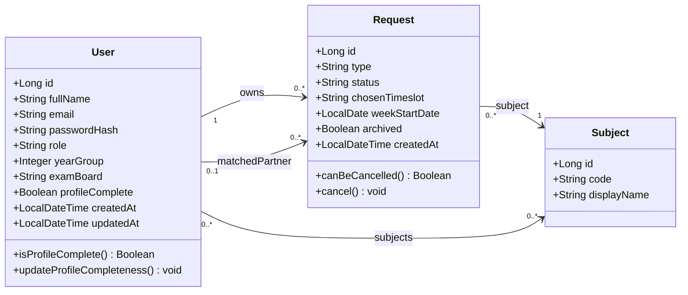

Source: src/main/java/com/example/studentportal/model/User.java, model/Request.java, model/Subject.java

---

### 1.2 Service Interaction Diagram (Part 1 of 2) — Controllers to Services

Caption: Controller layer classes and their dependencies on service layer classes; shows which controller calls which service.

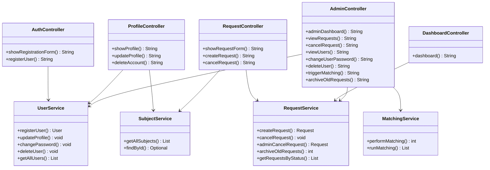

Source: src/main/java/com/example/studentportal/controller/AuthController.java, controller/ProfileController.java, controller/RequestController.java, controller/DashboardController.java, controller/AdminController.java

---

### 1.2 Service Interaction Diagram (Part 2 of 2) — Services to Repositories

Caption: Service and scheduler classes and their dependencies on JPA repository interfaces; shows which service reads or writes which repository.

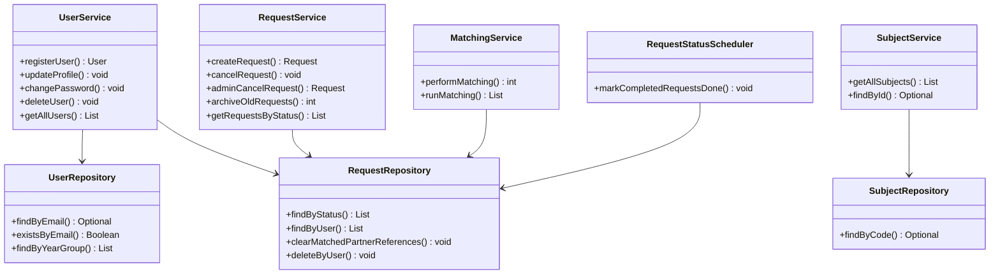

Source: src/main/java/com/example/studentportal/service/UserService.java, service/RequestService.java, service/MatchingService.java, service/RequestStatusScheduler.java, repository/UserRepository.java, repository/RequestRepository.java, repository/SubjectRepository.java

---

## 2. Hierarchical Chart

### 2.1 Hierarchical Chart (Part 1 of 3) — Authentication, Profile Management, Request Lifecycle

Caption: Top-level decomposition of Authentication, Profile Management, and Tutoring Request Lifecycle modules into leaf-level functions; each leaf names the responsible controller or service method.

```mermaid
graph TD
    ROOT["Student Peer-Tutoring Portal"]

    AUTH["Authentication and Registration"]
    PROF["Student Profile Management"]
    REQ["Tutoring Request Lifecycle"]

    ROOT --> AUTH
    ROOT --> PROF
    ROOT --> REQ

    AUTH --> B1["Register account<br>AuthController.registerUser()"]
    AUTH --> B2["Login and Logout<br>Spring Security + SecurityConfig"]
    AUTH --> B3["Role determination<br>UserService.determineRoleFromEmail()"]
    AUTH --> B4["Post-login redirect<br>CustomAuthenticationSuccessHandler"]

    PROF --> C1["View and edit profile<br>ProfileController.showProfile()"]
    PROF --> C2["Save year, examBoard, subjects, slots<br>ProfileController.updateProfile()"]
    PROF --> C3["Profile-complete gating<br>DashboardController and RequestController"]
    PROF --> C4["Delete own account<br>ProfileController.deleteAccount()"]

    REQ --> D1["Create TUTOR or TUTEE request<br>RequestController.createRequest()"]
    REQ --> D2["Validate: no duplicate active request<br>RequestService.hasActiveRequest()"]
    REQ --> D3["Validate: at least one timeslot selected<br>RequestController"]
    REQ --> D4["Cancel request with cascade<br>RequestService.cancelRequest()"]
    REQ --> D5["View dashboard<br>DashboardController.dashboard()"]
```

Source: src/main/java/com/example/studentportal/controller/AuthController.java, controller/ProfileController.java, controller/RequestController.java, controller/DashboardController.java, service/UserService.java, service/RequestService.java, config/SecurityConfig.java, config/CustomAuthenticationSuccessHandler.java

---

### 2.2 Hierarchical Chart (Part 2 of 3) — Admin Controls and Algorithmic Matching

Caption: Decomposition of Admin Controls and Algorithmic Matching modules; shows all admin-facing operations and the six steps of the matching pipeline.

```mermaid
graph TD
    ROOT["Student Peer-Tutoring Portal"]

    ADM["Admin Controls"]
    MATCH["Algorithmic Matching"]

    ROOT --> ADM
    ROOT --> MATCH

    ADM --> E1["View all requests filtered by status<br>AdminController.viewRequests()"]
    ADM --> E2["Cancel any request<br>AdminController.cancelRequest()"]
    ADM --> E3["Archive Done and Cancelled requests<br>AdminController.archiveOldRequests()"]
    ADM --> E4["View all users<br>AdminController.viewUsers()"]
    ADM --> E5["Reset user password<br>AdminController.changeUserPassword()"]
    ADM --> E6["Delete user account<br>AdminController.deleteUser()"]
    ADM --> E7["Trigger matching algorithm<br>AdminController.triggerMatching()"]

    MATCH --> F1["Build bipartite graph<br>MatchingService.runMatching()"]
    MATCH --> F2["Apply hard constraints<br>MatchingService.meetHardConstraints()"]
    MATCH --> F3["Calculate edge weights<br>MatchingService.calculateWeight()"]
    MATCH --> F4["Max-weight matching<br>JGraphT MaximumWeightBipartiteMatching"]
    MATCH --> F5["Greedy per-user conflict resolution<br>MatchingService.runMatching() greedy pass"]
    MATCH --> F6["Persist match results<br>MatchingService.performMatching()"]
```

Source: src/main/java/com/example/studentportal/controller/AdminController.java, service/MatchingService.java, repository/RequestRepository.java

---

### 2.3 Hierarchical Chart (Part 3 of 3) — Scheduled Automation and Data Access Layer

Caption: Decomposition of the Scheduled Automation and Data Access Layer modules; shows the scheduler pipeline and each repository's key query methods.

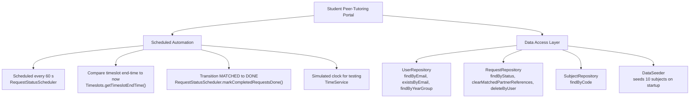

Source: src/main/java/com/example/studentportal/service/RequestStatusScheduler.java, service/TimeService.java, util/Timeslots.java, repository/UserRepository.java, repository/RequestRepository.java, repository/SubjectRepository.java, config/DataSeeder.java

---

## 3. Data Flow Diagrams

### 3.1 Context DFD

Caption: System-level context diagram showing external actors (Student, Admin) and the single system boundary of the Student Peer-Tutoring Portal with all data flows.

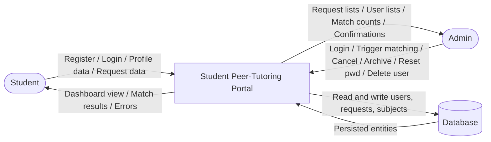

Source: src/main/java/com/example/studentportal/controller/ (all controllers), service/ (all services), repository/ (all repositories)

---

### 3.2 Level 0 DFD

Caption: Level 0 DFD decomposing the system into seven processes; shows data flows between external actors, processes, and the shared database store.

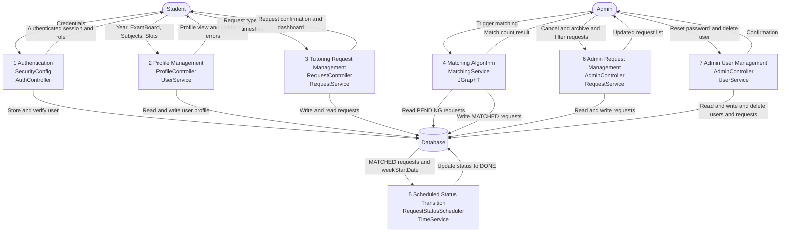

Source: src/main/java/com/example/studentportal/controller/ (all controllers), service/ (all services)

---

## 4. Flowcharts and Behavioural Diagrams

### 4.1 Authentication Workflow

Caption: Flowchart for the Spring Security login process including credential validation, role-based redirect, and profile-complete gating; corresponds to CustomAuthenticationSuccessHandler and CustomUserDetailsService.

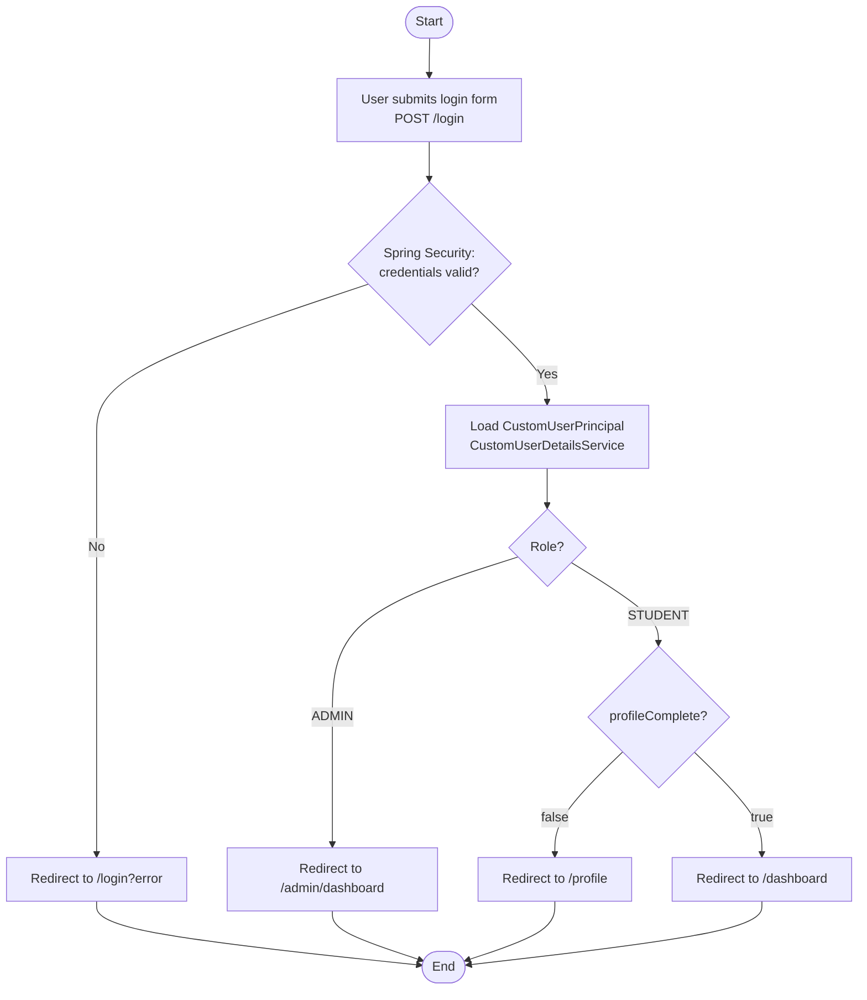

Source: src/main/java/com/example/studentportal/config/CustomAuthenticationSuccessHandler.java, service/CustomUserDetailsService.java

---

### 4.2 Registration Workflow

Caption: Flowchart for new user registration including server-side validation, role determination from email pattern, BCrypt hashing, and auto-authentication on success; corresponds to AuthController and UserService.

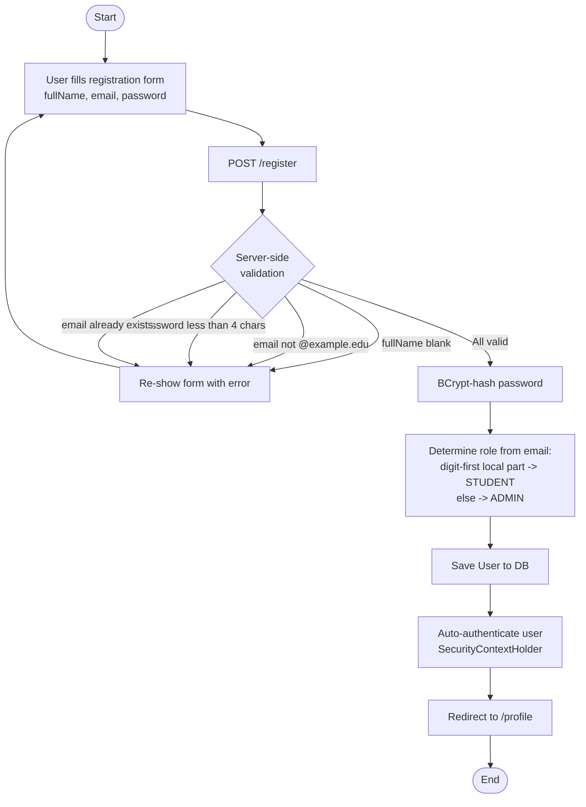

Source: src/main/java/com/example/studentportal/controller/AuthController.java, service/UserService.java

---

### 4.3 Create Tutoring Request Workflow

Caption: Flowchart for student creating a TUTOR or TUTEE request including profile-complete gating, duplicate-check, and timeslot validation; corresponds to RequestController and RequestService.

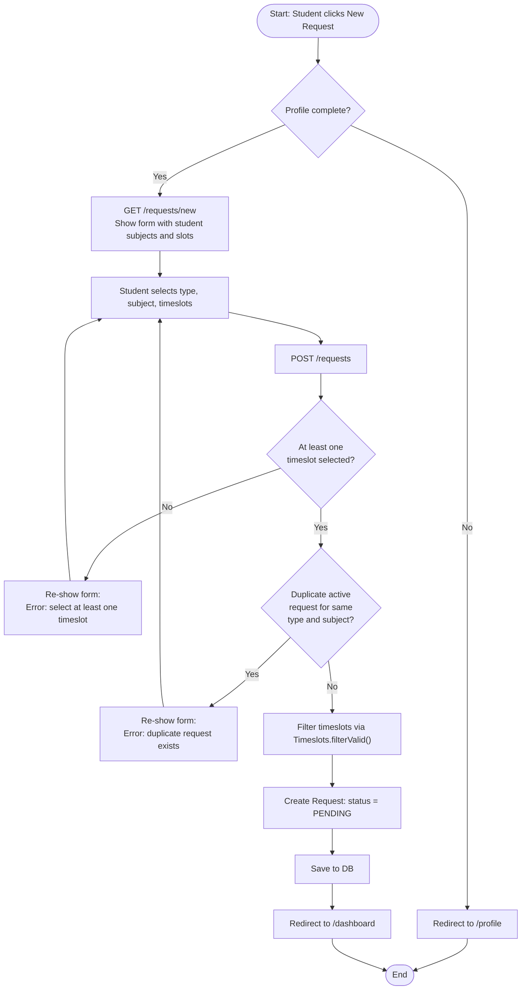

Source: src/main/java/com/example/studentportal/controller/RequestController.java, service/RequestService.java, util/Timeslots.java

---

### 4.4 Admin Matching Execution Workflow

Caption: Flowchart for the matching algorithm triggered by an admin; covers bipartite graph construction, hard-constraint filtering, edge weighting, JGraphT matching, and the greedy conflict-resolution pass; corresponds to MatchingService.

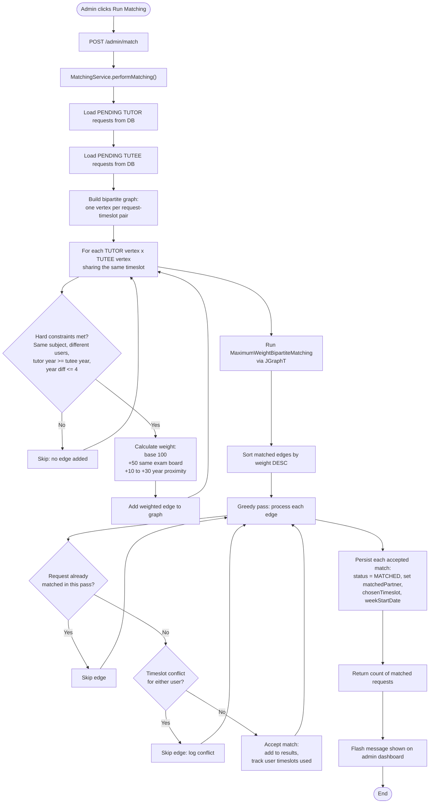

Source: src/main/java/com/example/studentportal/service/MatchingService.java, util/DateUtil.java

---

### 4.5 Cascade Cancellation Logic

Caption: Flowchart for student and admin request cancellation including ownership check, PENDING/MATCHED guard, and cascade cancellation of the matched partner's request; corresponds to RequestService.

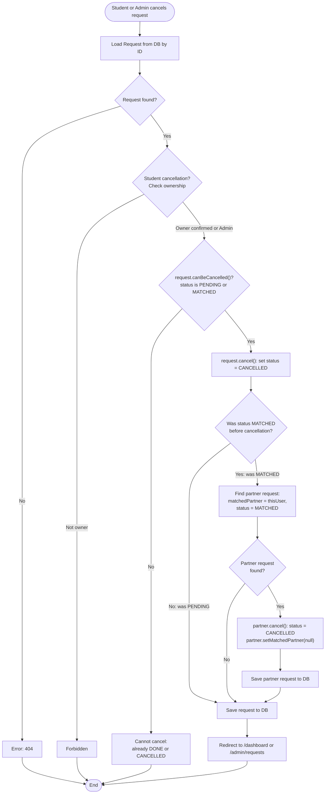

Source: src/main/java/com/example/studentportal/service/RequestService.java, model/Request.java

---

### 4.6 User Deletion Cascade Logic

Caption: Flowchart for admin-triggered user deletion including cascade cancellation of partner requests, clearing matchedPartner FK references, deletion of owned requests and user record, and self-deletion session invalidation; corresponds to UserService and AdminController.

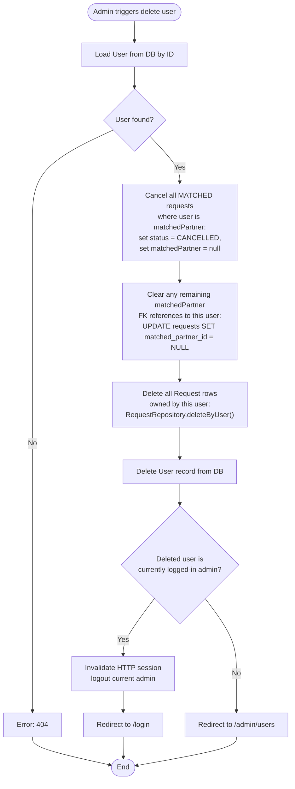

Source: src/main/java/com/example/studentportal/service/UserService.java, controller/AdminController.java, repository/RequestRepository.java

---

### 4.7 Scheduler DONE Transition Logic

Caption: Flowchart for the background scheduler that transitions MATCHED requests to DONE once the session timeslot end-time has elapsed; corresponds to RequestStatusScheduler, TimeService, and Timeslots utility.

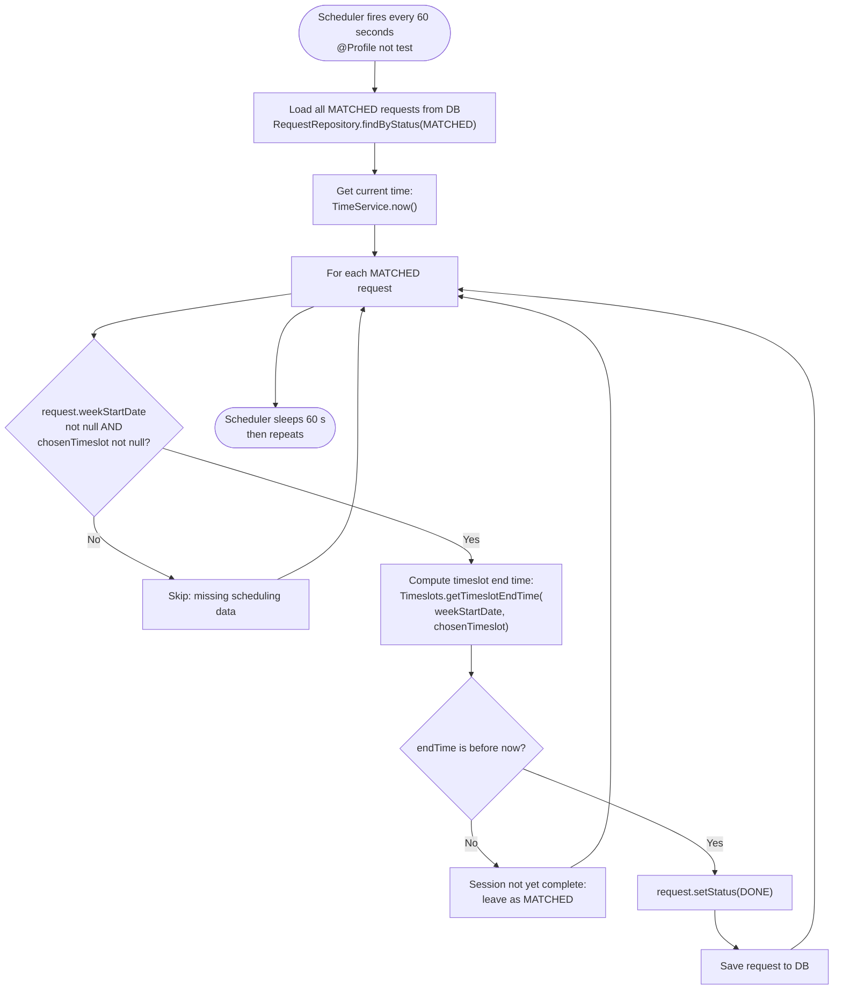

Source: src/main/java/com/example/studentportal/service/RequestStatusScheduler.java, service/TimeService.java, util/Timeslots.java

---

### 4.8 Dashboard Loading Logic

Caption: Flowchart for DashboardController handling role gating (ADMIN redirect), profileComplete gating (STUDENT), and the showArchived toggle controlling which requests are loaded; corresponds to DashboardController and RequestService.

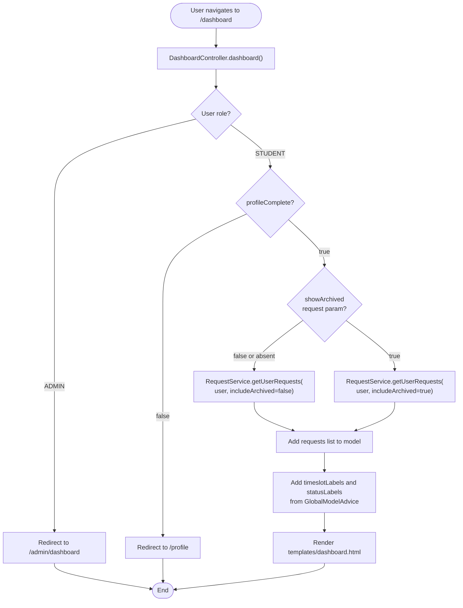

Source: src/main/java/com/example/studentportal/controller/DashboardController.java, service/RequestService.java, config/GlobalModelAdvice.java

---

## 5. Pseudocode for Key Logic

### 5.1 Matching Algorithm — MatchingService.runMatching() and helpers

Caption: IB pseudocode for the bipartite matching algorithm covering graph construction, hard constraints, weight calculation, JGraphT matching call, and greedy conflict-resolution pass.

```text
method runMatching()
    OFFER_REQUESTS = DB.findPendingByType("TUTOR")
    SEEK_REQUESTS  = DB.findPendingByType("TUTEE")

    GRAPH          = new SimpleWeightedGraph()
    OFFER_VERTICES = new Set()
    SEEK_VERTICES  = new Set()

    loop for each OFFER in OFFER_REQUESTS
        loop for each SLOT in OFFER.getTimeslots()
            RT = new RequestTimeslot(OFFER, SLOT)
            GRAPH.addVertex(RT)
            OFFER_VERTICES.add(RT)
        end loop
    end loop

    loop for each SEEK in SEEK_REQUESTS
        loop for each SLOT in SEEK.getTimeslots()
            RT = new RequestTimeslot(SEEK, SLOT)
            GRAPH.addVertex(RT)
            SEEK_VERTICES.add(RT)
        end loop
    end loop

    loop for each OFFER_RT in OFFER_VERTICES
        loop for each SEEK_RT in SEEK_VERTICES
            if OFFER_RT.getTimeslot() = SEEK_RT.getTimeslot() AND
               meetHardConstraints(OFFER_RT.getRequest(), SEEK_RT.getRequest()) then
                WEIGHT = calculateWeight(OFFER_RT.getRequest(), SEEK_RT.getRequest())
                if WEIGHT > 0 then
                    GRAPH.addEdge(OFFER_RT, SEEK_RT, WEIGHT)
                end if
            end if
        end loop
    end loop

    MATCHING     = MaximumWeightBipartiteMatching(GRAPH, OFFER_VERTICES, SEEK_VERTICES)
    MATCHED_EDGES = MATCHING.getEdges()

    USER_SLOTS = new Map()
    EXISTING   = DB.findByStatus("MATCHED")
    loop for each EXISTING_REQ in EXISTING
        if EXISTING_REQ.getChosenTimeslot() not null then
            UID = EXISTING_REQ.getUser().getId()
            USER_SLOTS[UID].add(EXISTING_REQ.getChosenTimeslot())
        end if
    end loop

    SORTED_EDGES   = sort MATCHED_EDGES by weight descending
    ACCEPTED       = new List()
    USED_OFFER_IDS = new Set()
    USED_SEEK_IDS  = new Set()

    loop for each EDGE in SORTED_EDGES
        OFFER_RT  = getOfferSide(EDGE)
        SEEK_RT   = getSeekSide(EDGE)
        OFFER_REQ = OFFER_RT.getRequest()
        SEEK_REQ  = SEEK_RT.getRequest()
        SLOT      = OFFER_RT.getTimeslot()
        TUTOR_ID  = OFFER_REQ.getUser().getId()
        TUTEE_ID  = SEEK_REQ.getUser().getId()

        if OFFER_REQ.getId() NOT IN USED_OFFER_IDS AND
           SEEK_REQ.getId()  NOT IN USED_SEEK_IDS  AND
           SLOT NOT IN USER_SLOTS[TUTOR_ID]         AND
           SLOT NOT IN USER_SLOTS[TUTEE_ID] then

            ACCEPTED.add(new Match(OFFER_REQ, SEEK_REQ, SLOT, EDGE.getWeight()))
            USED_OFFER_IDS.add(OFFER_REQ.getId())
            USED_SEEK_IDS.add(SEEK_REQ.getId())
            USER_SLOTS[TUTOR_ID].add(SLOT)
            USER_SLOTS[TUTEE_ID].add(SLOT)
        end if
    end loop

    return ACCEPTED
end method


method meetHardConstraints(OFFER_REQ, SEEK_REQ)
    TUTOR = OFFER_REQ.getUser()
    TUTEE = SEEK_REQ.getUser()

    if NOT (OFFER_REQ.getSubject().getCode() = SEEK_REQ.getSubject().getCode()) then
        return false
    end if

    TUTOR_SLOTS = OFFER_REQ.getTimeslots()
    TUTEE_SLOTS = SEEK_REQ.getTimeslots()
    OVERLAP = false
    loop for each SLOT in TUTOR_SLOTS
        if SLOT IN TUTEE_SLOTS then
            OVERLAP = true
        end if
    end loop
    if OVERLAP = false then
        return false
    end if

    if TUTOR.getYearGroup() < TUTEE.getYearGroup() then
        return false
    end if

    if TUTOR.getId() = TUTEE.getId() then
        return false
    end if

    return true
end method


method calculateWeight(OFFER_REQ, SEEK_REQ)
    if NOT meetHardConstraints(OFFER_REQ, SEEK_REQ) then
        return 0
    end if

    WEIGHT = 100
    TUTOR  = OFFER_REQ.getUser()
    TUTEE  = SEEK_REQ.getUser()

    if TUTOR.getExamBoard() not null AND
       TUTOR.getExamBoard() = TUTEE.getExamBoard() AND
       NOT (TUTOR.getExamBoard() = "NONE") then
        WEIGHT = WEIGHT + 50
    end if

    YEAR_DIFF = TUTOR.getYearGroup() - TUTEE.getYearGroup()
    if YEAR_DIFF = 1 then
        WEIGHT = WEIGHT + 30
    else if YEAR_DIFF = 0 then
        WEIGHT = WEIGHT + 25
    else if YEAR_DIFF = 2 then
        WEIGHT = WEIGHT + 20
    else if YEAR_DIFF = 3 then
        WEIGHT = WEIGHT + 15
    else if YEAR_DIFF = 4 then
        WEIGHT = WEIGHT + 10
    end if

    return WEIGHT
end method
```

Source: src/main/java/com/example/studentportal/service/MatchingService.java

---

### 5.2 Scheduler Status Update — RequestStatusScheduler.markCompletedRequestsDone()

Caption: IB pseudocode for the scheduled background task that checks every 60 seconds whether any MATCHED request's timeslot end-time has elapsed and transitions it to DONE.

```text
method markCompletedRequestsDone()
    NOW              = timeService.now()
    MATCHED_REQUESTS = DB.findByStatus("MATCHED")

    loop for each REQUEST in MATCHED_REQUESTS
        if REQUEST.getWeekStartDate() = null OR REQUEST.getChosenTimeslot() = null then
            continue
        end if

        END_TIME = Timeslots.getTimeslotEndTime(REQUEST.getWeekStartDate(),
                                                REQUEST.getChosenTimeslot())

        if END_TIME not null AND NOW.isAfter(END_TIME) then
            REQUEST.setStatus("DONE")
            DB.save(REQUEST)
        end if
    end loop
end method
```

Source: src/main/java/com/example/studentportal/service/RequestStatusScheduler.java, service/TimeService.java, util/Timeslots.java

---

### 5.3 Request Cancellation Cascade — RequestService.cancelRequest() and adminCancelRequest()

Caption: IB pseudocode for the student and admin cancellation paths; includes ownership check, canBeCancelled guard, and cascade cancellation of the matched partner's request when the cancelled request was MATCHED.

```text
method cancelRequest(REQUEST_ID, CANCELLING_USER)
    REQUEST = DB.findById(REQUEST_ID)
    if REQUEST = null then
        throw NotFoundException
    end if

    if CANCELLING_USER not null AND
       NOT (REQUEST.getUser() = CANCELLING_USER) then
        throw ForbiddenException
    end if

    if NOT REQUEST.canBeCancelled() then
        return
    end if

    PREVIOUS_STATUS = REQUEST.getStatus()
    REQUEST.cancel()
    DB.save(REQUEST)

    if PREVIOUS_STATUS = "MATCHED" then
        PARTNER = REQUEST.getMatchedPartner()
        PARTNER_REQS = DB.findByUserAndMatchedPartnerAndStatus(
                           PARTNER, REQUEST.getUser(), "MATCHED")
        loop for each PARTNER_REQ in PARTNER_REQS
            PARTNER_REQ.cancel()
            PARTNER_REQ.setMatchedPartner(null)
            DB.save(PARTNER_REQ)
        end loop
    end if
end method


method adminCancelRequest(REQUEST_ID)
    call cancelRequest(REQUEST_ID, null)
end method
```

Source: src/main/java/com/example/studentportal/service/RequestService.java, model/Request.java

---

### 5.4 User Deletion Cascade — UserService.deleteUser()

Caption: IB pseudocode for admin-triggered user deletion; covers cascade cancellation of partner MATCHED requests, clearing of FK references, deletion of owned requests, user record deletion, and self-deletion session invalidation.

```text
method deleteUser(USER_ID, CURRENT_SESSION)
    USER = DB.findById(USER_ID)
    if USER = null then
        throw NotFoundException
    end if

    PARTNER_REQUESTS = DB.findByMatchedPartnerAndStatus(USER, "MATCHED")
    loop for each REQ in PARTNER_REQUESTS
        REQ.setStatus("CANCELLED")
        REQ.setMatchedPartner(null)
        DB.save(REQ)
    end loop

    DB.clearMatchedPartnerReferences(USER)

    DB.deleteByUser(USER)

    DB.delete(USER)

    if CURRENT_SESSION.getUserId() = USER_ID then
        CURRENT_SESSION.invalidate()
        redirect("/login")
    else
        redirect("/admin/users")
    end if
end method
```

Source: src/main/java/com/example/studentportal/service/UserService.java, controller/AdminController.java, repository/RequestRepository.java
