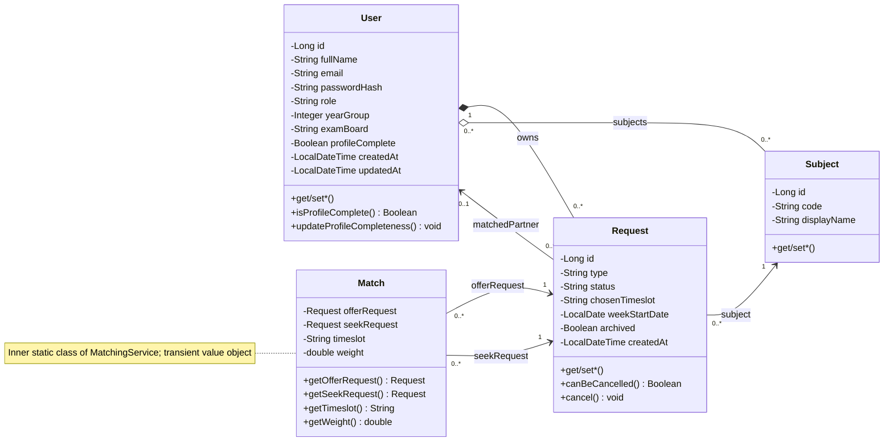
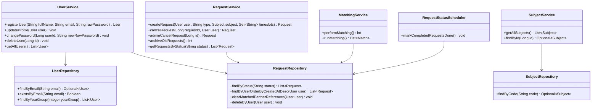
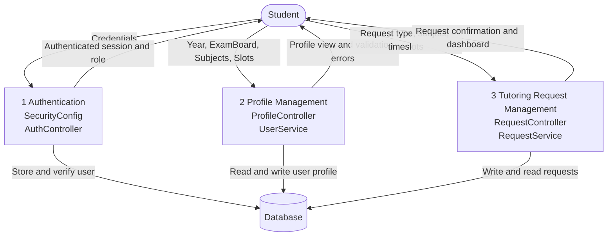
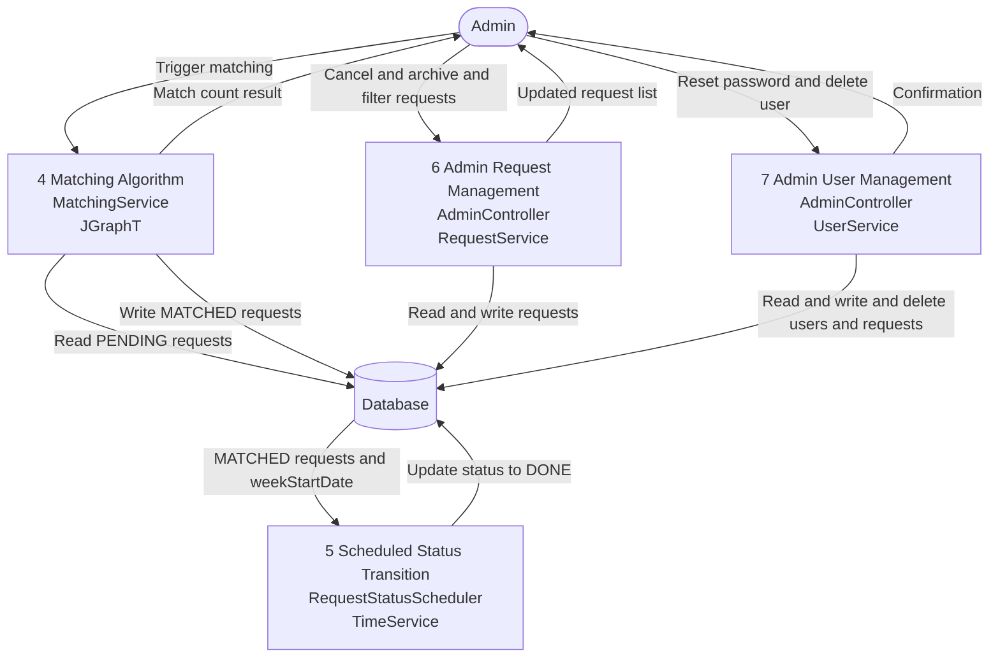

# Criterion B – Design Overview: Diagrams and Pseudocode

> **Product:** Student Peer-Tutoring Portal
> **Tech Stack:** Java 17, Spring Boot 3, Spring Security, Thymeleaf, JPA/Hibernate, H2/PostgreSQL, JGraphT
>
> This file contains the non-database, non-UI-mockup design artefacts only.
> Sections 1 (Databases/ERD) and 2 (UI Mockups) are covered in separate completed artefacts.

---

## 1. UML Diagrams

### 1.1 Domain Class Diagram

Caption: Domain entities, Match value object, and relationships.



Source: src/main/java/com/example/studentportal/model/User.java, model/Request.java, model/Subject.java, service/MatchingService.java (inner Match class)

---

### 1.2 Service Interaction Diagram (Part 1 of 2) — Controllers to Services

Caption: Controller and service classes with method signatures.

```mermaid
classDiagram
    direction TB

    class AuthController {
        +showRegistrationForm(Model model) String
        +registerUser(RegistrationForm form, BindingResult result) String
    }

    class ProfileController {
        +showProfile(Principal principal, Model model) String
        +updateProfile(Principal principal, Integer yearGroup, String examBoard, List~Long~ subjectIds, List~String~ timeslots) String
        +deleteAccount(Principal principal) String
    }

    class RequestController {
        +showRequestForm(Principal principal, Model model) String
        +createRequest(Principal principal, String type, Long subjectId, List~String~ timeslots) String
        +cancelRequest(Principal principal, Long id) String
    }

    class DashboardController {
        +dashboard(Principal principal, boolean showArchived, Model model) String
    }

    class AdminController {
        +adminDashboard(Principal principal, Model model) String
        +viewRequests(String status, boolean showArchived, Model model) String
        +cancelRequest(Long id, String status, boolean showArchived) String
        +viewUsers(Integer yearGroup, Model model) String
        +changeUserPassword(Long id, String newPassword) String
        +deleteUser(Long id) String
        +triggerMatching() String
        +archiveOldRequests() String
    }

    class UserService {
        +registerUser(String fullName, String email, String rawPassword) User
        +updateProfile(User user) void
        +changePassword(Long userId, String newRawPassword) void
        +deleteUser(Long id) void
        +getAllUsers() List~User~
    }

    class RequestService {
        +createRequest(User user, String type, Subject subject, Set~String~ timeslots) Request
        +cancelRequest(Long requestId, User user) Request
        +adminCancelRequest(Long id) Request
        +archiveOldRequests() int
        +getRequestsByStatus(String status) List~Request~
    }

    class MatchingService {
        +performMatching() int
        +runMatching() List~Match~
    }

    class SubjectService {
        +getAllSubjects() List~Subject~
        +findById(Long id) Optional~Subject~
    }

    AuthController --> UserService
    ProfileController --> UserService
    ProfileController --> SubjectService
    RequestController --> RequestService
    RequestController --> SubjectService
    DashboardController --> RequestService
    AdminController --> UserService
    AdminController --> RequestService
    AdminController --> MatchingService
```



Source: src/main/java/com/example/studentportal/controller/AuthController.java, controller/ProfileController.java, controller/RequestController.java, controller/DashboardController.java, controller/AdminController.java

---

### 1.2 Service Interaction Diagram (Part 2 of 2) — Services to Repositories

Caption: Service and scheduler classes with repository method signatures.



Source: src/main/java/com/example/studentportal/service/UserService.java, service/RequestService.java, service/MatchingService.java, service/RequestStatusScheduler.java, repository/UserRepository.java, repository/RequestRepository.java, repository/SubjectRepository.java

---

## 2. Hierarchical Chart

### 2.1 Hierarchical Chart (Part 1 of 3) — Authentication, Profile Management, Request Lifecycle

Caption: Top-level decomposition of Authentication, Profile Management, and Tutoring Request Lifecycle modules into leaf-level functions; each leaf names the responsible controller or service method.


Source: src/main/java/com/example/studentportal/controller/AuthController.java, controller/ProfileController.java, controller/RequestController.java, controller/DashboardController.java, service/UserService.java, service/RequestService.java, config/SecurityConfig.java, config/CustomAuthenticationSuccessHandler.java

---

### 2.2 Hierarchical Chart (Part 2 of 3) — Admin Controls and Algorithmic Matching

Caption: Decomposition of Admin Controls and Algorithmic Matching modules; shows all admin-facing operations and the six steps of the matching pipeline.


Source: src/main/java/com/example/studentportal/controller/AdminController.java, service/MatchingService.java, repository/RequestRepository.java

---

### 2.3 Hierarchical Chart (Part 3 of 3) — Scheduled Automation and Data Access Layer

Caption: Decomposition of the Scheduled Automation and Data Access Layer modules; shows the scheduler pipeline and each repository's key query methods.


Source: src/main/java/com/example/studentportal/service/RequestStatusScheduler.java, service/TimeService.java, util/Timeslots.java, repository/UserRepository.java, repository/RequestRepository.java, repository/SubjectRepository.java, config/DataSeeder.java

---

## 3. Data Flow Diagrams

### 3.1 Context DFD

Caption: System-level context diagram showing external actors (Student, Admin) and the single system boundary of the Student Peer-Tutoring Portal with all data flows.


Source: src/main/java/com/example/studentportal/controller/ (all controllers), service/ (all services), repository/ (all repositories)

---

### 3.2 Level 0 DFD (Part 1 of 2) — Student-facing Processes

Caption: Data flows for student interactions: auth, profile, and requests.



Source: src/main/java/com/example/studentportal/controller/AuthController.java, controller/ProfileController.java, controller/RequestController.java, service/UserService.java, service/RequestService.java

---

### 3.2 Level 0 DFD (Part 2 of 2) — Admin-facing Processes and Background Automation

Caption: Data flows for admin operations and scheduled transitions.



Source: src/main/java/com/example/studentportal/controller/AdminController.java, service/MatchingService.java, service/RequestStatusScheduler.java, service/UserService.java, service/RequestService.java

---

## 4. Flowcharts and Behavioural Diagrams

### 4.1 Authentication Workflow

Caption: Flowchart for the Spring Security login process including credential validation, role-based redirect, and profile-complete gating; corresponds to CustomAuthenticationSuccessHandler and CustomUserDetailsService.


Source: src/main/java/com/example/studentportal/config/CustomAuthenticationSuccessHandler.java, service/CustomUserDetailsService.java

---

### 4.2 Registration Workflow

Caption: Flowchart for new user registration including server-side validation, role determination from email pattern, BCrypt hashing, and auto-authentication on success; corresponds to AuthController and UserService.


Source: src/main/java/com/example/studentportal/controller/AuthController.java, service/UserService.java

---

### 4.3 Create Tutoring Request Workflow

Caption: Flowchart for student creating a TUTOR or TUTEE request including profile-complete gating, duplicate-check, and timeslot validation; corresponds to RequestController and RequestService.


Source: src/main/java/com/example/studentportal/controller/RequestController.java, service/RequestService.java, util/Timeslots.java

---

### 4.4 Admin Matching Execution Workflow

Caption: Flowchart for the matching algorithm triggered by an admin; covers bipartite graph construction, hard-constraint filtering, edge weighting, JGraphT matching, and the greedy conflict-resolution pass; corresponds to MatchingService.


Source: src/main/java/com/example/studentportal/service/MatchingService.java, util/DateUtil.java

---

### 4.5 Cascade Cancellation Logic

Caption: Flowchart for student and admin request cancellation including ownership check, PENDING/MATCHED guard, and cascade cancellation of the matched partner's request; corresponds to RequestService.


Source: src/main/java/com/example/studentportal/service/RequestService.java, model/Request.java

---

### 4.6 User Deletion Cascade Logic

Caption: Flowchart for admin-triggered user deletion including cascade cancellation of partner requests, clearing matchedPartner FK references, deletion of owned requests and user record, and self-deletion session invalidation; corresponds to UserService and AdminController.


Source: src/main/java/com/example/studentportal/service/UserService.java, controller/AdminController.java, repository/RequestRepository.java

---

### 4.7 Scheduler DONE Transition Logic

Caption: Flowchart for the background scheduler that transitions MATCHED requests to DONE once the session timeslot end-time has elapsed; corresponds to RequestStatusScheduler, TimeService, and Timeslots utility.


Source: src/main/java/com/example/studentportal/service/RequestStatusScheduler.java, service/TimeService.java, util/Timeslots.java

---

### 4.8 Dashboard Loading Logic

Caption: Flowchart for DashboardController handling role gating (ADMIN redirect), profileComplete gating (STUDENT), and the showArchived toggle controlling which requests are loaded; corresponds to DashboardController and RequestService.


Source: src/main/java/com/example/studentportal/controller/DashboardController.java, service/RequestService.java, config/GlobalModelAdvice.java

---

## 5. Pseudocode for Key Logic

### 5.1 Matching Algorithm — MatchingService.runMatching() and helpers

Caption: Bipartite matching: graph build, constraints, weights, greedy pass.

```text
// Bipartite graph matching algorithm.
// Constructs vertices for each (request, timeslot) pair, adds weighted edges
// where hard constraints pass, runs JGraphT max-weight matching, then applies
// a greedy pass to resolve per-user timeslot conflicts.

method runMatching()
    // Load all PENDING TUTOR and TUTEE requests from the database
    OFFER_REQUESTS = DB.findPendingByType("TUTOR")
    SEEK_REQUESTS  = DB.findPendingByType("TUTEE")

    GRAPH          = new SimpleWeightedGraph()
    OFFER_VERTICES = new Set()
    SEEK_VERTICES  = new Set()

    // Build offer-side vertices: one vertex per (TUTOR request, timeslot) pair
    loop for each OFFER in OFFER_REQUESTS
        loop for each SLOT in OFFER.getTimeslots()
            RT = new RequestTimeslot(OFFER, SLOT)
            GRAPH.addVertex(RT)
            OFFER_VERTICES.add(RT)
        end loop
    end loop

    // Build seek-side vertices: one vertex per (TUTEE request, timeslot) pair
    loop for each SEEK in SEEK_REQUESTS
        loop for each SLOT in SEEK.getTimeslots()
            RT = new RequestTimeslot(SEEK, SLOT)
            GRAPH.addVertex(RT)
            SEEK_VERTICES.add(RT)
        end loop
    end loop

    // Add a weighted edge for every offer-seek pair that shares a timeslot
    // and satisfies all hard constraints
    loop for each OFFER_RT in OFFER_VERTICES
        loop for each SEEK_RT in SEEK_VERTICES
            if OFFER_RT.getTimeslot() = SEEK_RT.getTimeslot() AND
               meetHardConstraints(OFFER_RT.getRequest(), SEEK_RT.getRequest()) then
                WEIGHT = calculateWeight(OFFER_RT.getRequest(), SEEK_RT.getRequest())
                if WEIGHT > 0 then
                    GRAPH.addEdge(OFFER_RT, SEEK_RT, WEIGHT)
                end if
            end if
        end loop
    end loop

    // Run JGraphT maximum-weight bipartite matching on the constructed graph
    MATCHING     = MaximumWeightBipartiteMatching(GRAPH, OFFER_VERTICES, SEEK_VERTICES)
    MATCHED_EDGES = MATCHING.getEdges()

    // Pre-load timeslots already used by existing MATCHED requests to prevent conflicts
    USER_SLOTS = new Map()
    EXISTING   = DB.findByStatus("MATCHED")
    loop for each EXISTING_REQ in EXISTING
        if EXISTING_REQ.getChosenTimeslot() not null then
            UID = EXISTING_REQ.getUser().getId()
            USER_SLOTS[UID].add(EXISTING_REQ.getChosenTimeslot())
        end if
    end loop

    SORTED_EDGES   = sort MATCHED_EDGES by weight descending
    ACCEPTED       = new List()
    USED_OFFER_IDS = new Set()
    USED_SEEK_IDS  = new Set()

    // Greedy pass: accept edges from highest to lowest weight, skipping any
    // edge where a request is already matched or the timeslot is already taken
    loop for each EDGE in SORTED_EDGES
        OFFER_RT  = getOfferSide(EDGE)
        SEEK_RT   = getSeekSide(EDGE)
        OFFER_REQ = OFFER_RT.getRequest()
        SEEK_REQ  = SEEK_RT.getRequest()
        SLOT      = OFFER_RT.getTimeslot()
        TUTOR_ID  = OFFER_REQ.getUser().getId()
        TUTEE_ID  = SEEK_REQ.getUser().getId()

        // Accept only if neither request is used and neither user has a clash
        if OFFER_REQ.getId() NOT IN USED_OFFER_IDS AND
           SEEK_REQ.getId()  NOT IN USED_SEEK_IDS  AND
           SLOT NOT IN USER_SLOTS[TUTOR_ID]         AND
           SLOT NOT IN USER_SLOTS[TUTEE_ID] then

            ACCEPTED.add(new Match(OFFER_REQ, SEEK_REQ, SLOT, EDGE.getWeight()))
            USED_OFFER_IDS.add(OFFER_REQ.getId())
            USED_SEEK_IDS.add(SEEK_REQ.getId())
            USER_SLOTS[TUTOR_ID].add(SLOT)
            USER_SLOTS[TUTEE_ID].add(SLOT)
        end if
    end loop

    return ACCEPTED
end method


// Hard-constraint gate: returns false if the pair must never be matched.
// Checks: same subject, overlapping timeslots, tutor year >= tutee year, different users.
method meetHardConstraints(OFFER_REQ, SEEK_REQ)
    TUTOR = OFFER_REQ.getUser()
    TUTEE = SEEK_REQ.getUser()

    // Subjects must be identical
    if NOT (OFFER_REQ.getSubject().getCode() = SEEK_REQ.getSubject().getCode()) then
        return false
    end if

    // At least one shared timeslot must exist
    TUTOR_SLOTS = OFFER_REQ.getTimeslots()
    TUTEE_SLOTS = SEEK_REQ.getTimeslots()
    OVERLAP = false
    loop for each SLOT in TUTOR_SLOTS
        if SLOT IN TUTEE_SLOTS then
            OVERLAP = true
        end if
    end loop
    if OVERLAP = false then
        return false
    end if

    // Tutor must be in the same or higher year group than the tutee
    if TUTOR.getYearGroup() < TUTEE.getYearGroup() then
        return false
    end if

    // A user cannot be matched with themselves
    if TUTOR.getId() = TUTEE.getId() then
        return false
    end if

    return true
end method


// Weight function: returns a score >= 100 for valid pairs.
// Base 100; +50 for same exam board; +10..+30 for year-group proximity.
method calculateWeight(OFFER_REQ, SEEK_REQ)
    // Reject immediately if hard constraints are not met
    if NOT meetHardConstraints(OFFER_REQ, SEEK_REQ) then
        return 0
    end if

    WEIGHT = 100
    TUTOR  = OFFER_REQ.getUser()
    TUTEE  = SEEK_REQ.getUser()

    // Bonus if both users are on the same exam board (and it is not NONE)
    if TUTOR.getExamBoard() not null AND
       TUTOR.getExamBoard() = TUTEE.getExamBoard() AND
       NOT (TUTOR.getExamBoard() = "NONE") then
        WEIGHT = WEIGHT + 50
    end if

    // Bonus based on year-group proximity; year diff of 1 is optimal
    YEAR_DIFF = TUTOR.getYearGroup() - TUTEE.getYearGroup()
    if YEAR_DIFF = 1 then
        WEIGHT = WEIGHT + 30
    else if YEAR_DIFF = 0 then
        WEIGHT = WEIGHT + 25
    else if YEAR_DIFF = 2 then
        WEIGHT = WEIGHT + 20
    else if YEAR_DIFF = 3 then
        WEIGHT = WEIGHT + 15
    else if YEAR_DIFF = 4 then
        WEIGHT = WEIGHT + 10
    end if

    return WEIGHT
end method
```

Source: src/main/java/com/example/studentportal/service/MatchingService.java

---

### 5.2 Scheduler Status Update — RequestStatusScheduler.markCompletedRequestsDone()

Caption: Scheduler: MATCHED to DONE transition.

```text
// Scheduled task (every 60 s, skipped in test profile).
// Loads all MATCHED requests; for each request whose timeslot end-time has
// passed (based on weekStartDate + chosenTimeslot), sets status to DONE.
// Requests missing weekStartDate or chosenTimeslot are skipped silently.

method markCompletedRequestsDone()
    NOW              = timeService.now()
    MATCHED_REQUESTS = DB.findByStatus("MATCHED")

    // Iterate all currently MATCHED requests and check whether their session is over
    loop for each REQUEST in MATCHED_REQUESTS
        // Skip requests that pre-date the scheduling feature (no date/slot stored)
        if REQUEST.getWeekStartDate() = null OR REQUEST.getChosenTimeslot() = null then
            continue
        end if

        // Compute the exact end datetime for this request's scheduled session
        END_TIME = Timeslots.getTimeslotEndTime(REQUEST.getWeekStartDate(),
                                                REQUEST.getChosenTimeslot())

        // Transition to DONE once the session end-time has elapsed
        if END_TIME not null AND NOW.isAfter(END_TIME) then
            REQUEST.setStatus("DONE")
            DB.save(REQUEST)
        end if
    end loop
end method
```

Source: src/main/java/com/example/studentportal/service/RequestStatusScheduler.java, service/TimeService.java, util/Timeslots.java

---

### 5.3 Request Cancellation Cascade — RequestService.cancelRequest() and adminCancelRequest()

Caption: Request cancellation with partner cascade.

```text
// Student and admin cancellation paths.
// Checks ownership (student) or bypasses it (admin, null user).
// Guards against cancelling DONE/CANCELLED requests.
// If the cancelled request was MATCHED, also cancels the partner's linked request.

method cancelRequest(REQUEST_ID, CANCELLING_USER)
    // Look up the request; throw if not found
    REQUEST = DB.findById(REQUEST_ID)
    if REQUEST = null then
        throw NotFoundException
    end if

    // Students may only cancel their own requests
    if CANCELLING_USER not null AND
       NOT (REQUEST.getUser() = CANCELLING_USER) then
        throw ForbiddenException
    end if

    // Only PENDING or MATCHED requests can be cancelled
    if NOT REQUEST.canBeCancelled() then
        return
    end if

    PREVIOUS_STATUS = REQUEST.getStatus()
    REQUEST.cancel()
    DB.save(REQUEST)

    // If the request was MATCHED, cascade and cancel the partner's linked request
    if PREVIOUS_STATUS = "MATCHED" then
        PARTNER = REQUEST.getMatchedPartner()
        PARTNER_REQS = DB.findByUserAndMatchedPartnerAndStatus(
                           PARTNER, REQUEST.getUser(), "MATCHED")
        loop for each PARTNER_REQ in PARTNER_REQS
            PARTNER_REQ.cancel()
            PARTNER_REQ.setMatchedPartner(null)
            DB.save(PARTNER_REQ)
        end loop
    end if
end method


// Admin shortcut: delegates to cancelRequest with no ownership check (null user)
method adminCancelRequest(REQUEST_ID)
    call cancelRequest(REQUEST_ID, null)
end method
```

Source: src/main/java/com/example/studentportal/service/RequestService.java, model/Request.java

---

### 5.4 User Deletion Cascade — UserService.deleteUser()

Caption: User deletion with cascade cancellation.

```text
// Admin-triggered user deletion.
// Cancels all MATCHED requests where this user is the matched partner,
// clears any remaining FK references, deletes all owned requests,
// then deletes the user record.
// If the deleted user is the currently logged-in admin, the session is invalidated.

method deleteUser(USER_ID, CURRENT_SESSION)
    // Look up the user; throw if not found
    USER = DB.findById(USER_ID)
    if USER = null then
        throw NotFoundException
    end if

    // Cancel all requests whose matched partner is the user being deleted
    PARTNER_REQUESTS = DB.findByMatchedPartnerAndStatus(USER, "MATCHED")
    loop for each REQ in PARTNER_REQUESTS
        REQ.setStatus("CANCELLED")
        REQ.setMatchedPartner(null)
        DB.save(REQ)
    end loop

    // Null out any remaining matched_partner_id FK pointing to this user
    DB.clearMatchedPartnerReferences(USER)

    // Remove all tutoring requests owned by this user
    DB.deleteByUser(USER)

    // Delete the user record itself
    DB.delete(USER)

    // If the admin deleted their own account, invalidate their session
    if CURRENT_SESSION.getUserId() = USER_ID then
        CURRENT_SESSION.invalidate()
        redirect("/login")
    else
        redirect("/admin/users")
    end if
end method
```

Source: src/main/java/com/example/studentportal/service/UserService.java, controller/AdminController.java, repository/RequestRepository.java
