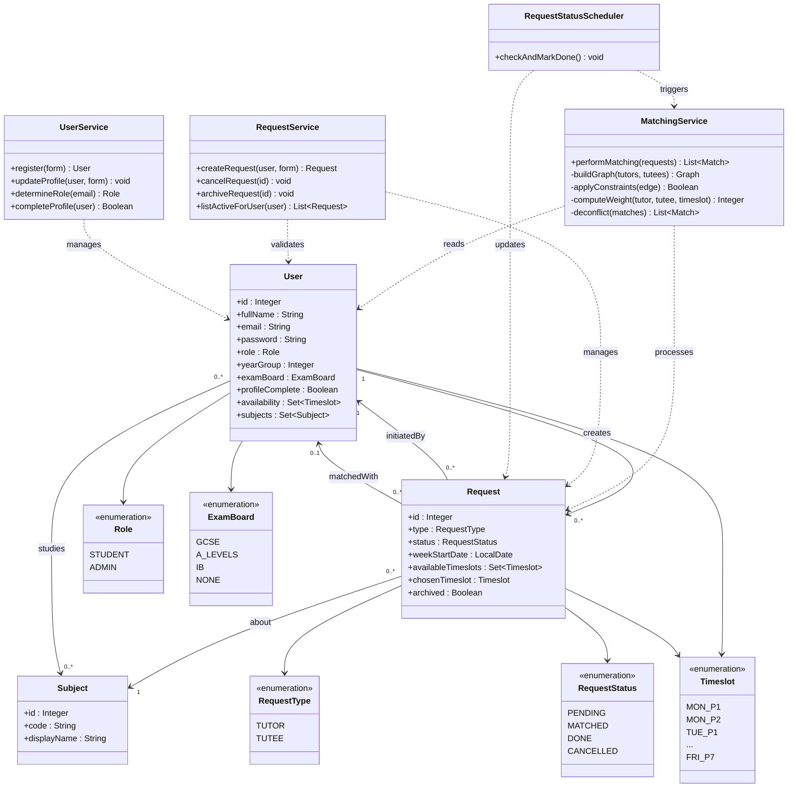

# IB Computer Science IA — Design Overview Diagrams

---

## 1. UML Class Diagram

---

## 2. System Overview Diagram

---

## 3. Flowchart — Request / Booking Workflow

---

## 4. Flowchart — Matching Algorithm

---

## 5. Flowchart — User Interaction Process

---

## 6. Sequence Diagram — Student Books a Tutoring Session

---

## 7. Data Model (ER-style) Diagram

---

## 8. State Diagram — Request Lifecycle

---

## 9. Module Dependency Diagram

